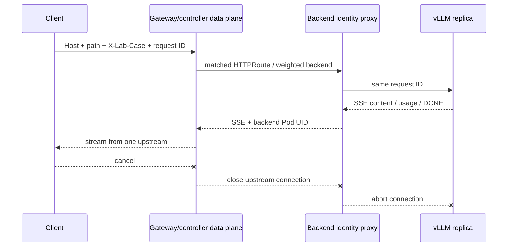

# Gateway API v1 实验 Contract

本文件描述 Week 16 的验收方式。当前 compatibility/capability 均为待真实集群填写，
参见 [中文代码导读](week-16-code-walkthrough.md) 与 [版本锁](../configs/cluster-lab.yaml)。

## 资源与版本

每个 replica 是 `1 Pod / 1 node / G GPUs / TP=G`，两个独立 Service 各选一个 replica。
全部 Route/backend 同 namespace，HPA 关闭，总 GPU allocation 为 `2 × G`。
image digest、模型 revision、CRD bundle、controller/data-plane release、Kubernetes 版本
都必须绑定本次结果；仓库不自动替你选择未验证的兼容版本。

| 能力 | 规范意图 | 本次实现证据 | 当前状态 |
|---|---|---|---|
| HTTP hostname / exact path / header | 匹配指定规则 | release conformance + route status + access log | pending |
| Weighted backendRefs | 相对权重选择 backend | 足够样本的 request/attempt 分布 | pending |
| SSE streaming | 单 stream 固定 upstream | 首段时延、持续 chunk、结束标记 | pending |
| 取消 | downstream 断开传给 upstream | controller/identity/vLLM 的 abort 证据 | pending |
| Invalid Service / port | 引用无法解析 | ResolvedRefs 与实际响应 | pending |
| 无匹配 / 无 Ready endpoint | 独立失败行为 | 实际 status、错误类型、后端日志窗口 | pending |

HTTP timeout/retry、buffering 和 private Service 设置属于固定 controller 的运行事实，
不要仅根据 Gateway API v1 名称宣称一致支持。

## 状态与请求关联



请求前保存 resource generation、observedGeneration、GatewayClass Accepted、Gateway
Accepted/Programmed、HTTPRoute 正确 parent 的 Accepted/ResolvedRefs。请求后保存相同
版本的 resource snapshot，排除 run 中配置更新。

## Controller access log 归一化 schema

每一条实际 upstream attempt 一行；从固定 controller 原始日志提取，保留原文件。

```json
{
  "event": "request",
  "request_id": "unique-client-request-id",
  "route_name": "inference/rule-half",
  "upstream": "vllm-a",
  "pod_uid": "actual-pod-uid",
  "upstream_attempts": 1,
  "status": "completed",
  "http_status": 200,
  "admitted_at": 0,
  "completed_at": 0
}
```

上面数字仅描述字段类型，必须替换成实际时间；它不是一条测量记录。若 controller 只
给 Pod IP，用同窗口 EndpointSlice/Pod snapshot 映射到 UID。Pod 重建后同一个 IP 可能
复用，不能拿另一时间的 inventory 直接关联。

无匹配请求可能没有 upstream attempt，应另保存 gateway response/access record，证明
记录覆盖整个窗口。零条 identity 日志也可能是采集缺失，不能自动证明零 backend hit。
分析会显示缺失 attribution，需要人工结合完整窗口判定预期负例。

## 验收与限制

- 每个正式 case 至少三次独立重复；权重默认每次至少 1000 请求，按预设区间判断。
- 请求 count、upstream attempts、token load 和成功率分别报告；不隐藏 retry。
- direct Service 只作 smoke/路径开销参考，不当成与 gateway 同路径的算法 A/B。
- image/model warmup 不计入稳态 latency，仍计入生命周期和资源成本。
- 对比前确认客户端、identity proxy、gateway 未先饱和。
- 资源被 API server 接受、CPU 单测通过和生成 YAML 都不能代替真实运行验收。
