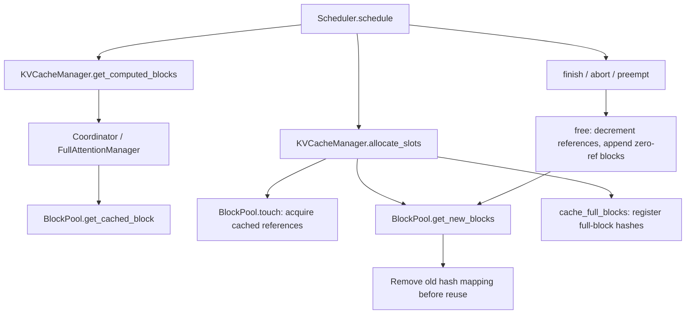

# vLLM KV Cache 源码地图

基线：`v0.10.2 / 01efc7ef781391e744ed08c3292817a773d654e6`，单组 full attention。
下表是源码关系，runtime 结论还需要 [Week 9](week-09-code-walkthrough.md) 的实际 trace。

| 入口 | 固定源码 | 负责什么 |
|---|---|---|
| Scheduler | [scheduler.py](https://github.com/vllm-project/vllm/blob/01efc7ef781391e744ed08c3292817a773d654e6/vllm/v1/core/sched/scheduler.py) | 查 prefix、申请 slots、处理 allocation failure、free |
| KVCacheManager | [kv_cache_manager.py](https://github.com/vllm-project/vllm/blob/01efc7ef781391e744ed08c3292817a773d654e6/vllm/v1/core/kv_cache_manager.py) | 把 request token 进度转换成需分配/命中的 block 集合 |
| Coordinator | [kv_cache_coordinator.py](https://github.com/vllm-project/vllm/blob/01efc7ef781391e744ed08c3292817a773d654e6/vllm/v1/core/kv_cache_coordinator.py) | 协调 KV groups，委托各组 manager |
| Single-type manager | [single_type_kv_cache_manager.py](https://github.com/vllm-project/vllm/blob/01efc7ef781391e744ed08c3292817a773d654e6/vllm/v1/core/single_type_kv_cache_manager.py) | request→blocks 列表、full attention lookup、reverse free |
| BlockPool | [block_pool.py](https://github.com/vllm-project/vllm/blob/01efc7ef781391e744ed08c3292817a773d654e6/vllm/v1/core/block_pool.py) | free queue、ref_count、hash→physical blocks、touch/evict |
| Hash / block / queue | [kv_cache_utils.py](https://github.com/vllm-project/vllm/blob/01efc7ef781391e744ed08c3292817a773d654e6/vllm/v1/core/kv_cache_utils.py) | block hash、`KVCacheBlock`、双向 free queue |

`null_block` 从 pool 中保留一个 ID，不能按普通 ref_count/free queue 规则计算。
`get_computed_blocks` 的最大命中长度是 `request.num_tokens - 1`，还要向完整 block
对齐，以便最后一步获得 logits。`allocate_slots` 在执行前登记本步可提交的 full block；
hash 登记事件本身不是 GPU 已经完成写入的时间戳。

Free queue 保存可分配的 blocks，其中仍可含有有效 cache hash。释放时请求的尾部
blocks 优先入队；再次从队头分配才可能移除旧 mapping。不要将这条具体规则简单
替换成一句没有边界条件的“整个系统使用 LRU”。
