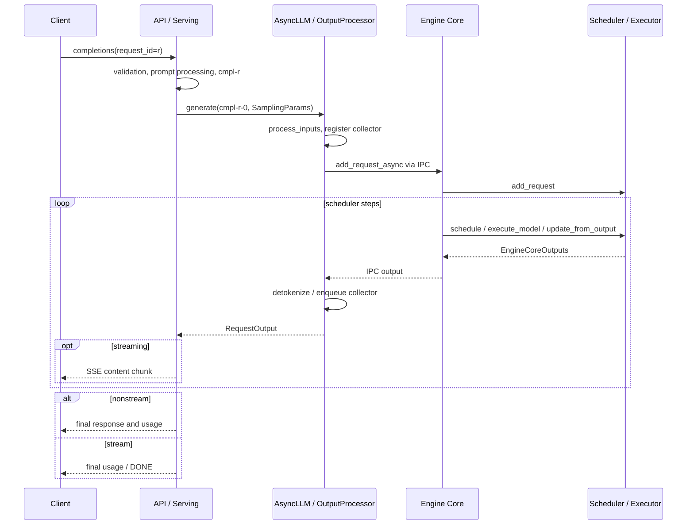
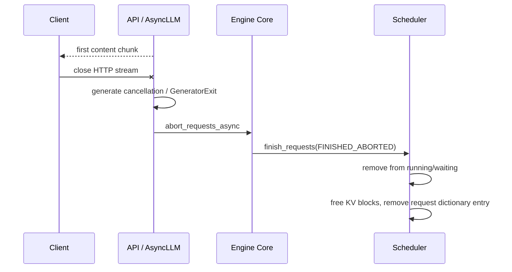

# vLLM 请求与输出时序

基于 [固定源码地图](vllm-source-map.md) 绘制。以下图表示源码确认的控制流；实际 trace
由 [Week 7 runner](../scripts/run_week07_trace.sh) 产生，不预先填写 PID、耗时和运行结论。

## 普通请求与 streaming

API 与 AsyncLLM 是组件边界，并不表示两个进程。Engine Core 的跨进程边界需要
`ipc_submit.pid != core_received.pid`。Scheduler 与 Executor 画在一个参与者中表示本周
追踪范围；worker 的实际进程部署由 executor 决定。

请求 state / KV blocks 可以在最后一个客户端字节到达前已释放，故不要要求
`request_freed` 必须排在客户端 DONE 之后。流式输出的第一次 event 也可能不含文字；
本实验只把非空 content 当作客户端 first chunk。

## Client disconnect 与取消

断开与正常完成可能竞争。只有看到 `FINISHED_ABORTED` 的实际 free event，且取消传播
顺序一致，才说明这次请求证明了 abort 路径。否则保留 trace，标记未验证并重新设计短
场景。不存在模型等 validation failure 在 API 侧结束，不应该出现 Engine Core admission。
