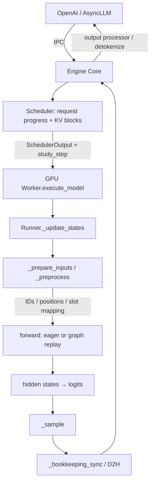

# GPU Worker 与 Model Runner 源码地图

固定版本同 [KV map](vllm-kv-cache-map.md)。Worker 管理设备与执行生命周期，Model Runner
持有 persistent batch、GPU 输入 buffers、模型和 sampler。一个类名不等于一个进程；
单 GPU executor 的进程身份用事件 PID 确认。

| 阶段 | 固定源码 | 阅读重点 |
|---|---|---|
| Worker 初始化 | [gpu_worker.py](https://github.com/vllm-project/vllm/blob/01efc7ef781391e744ed08c3292817a773d654e6/vllm/v1/worker/gpu_worker.py) | `init_device`、`load_model`、`determine_available_memory`、`initialize_from_config`、`compile_or_warm_up_model` |
| 每步执行 | [gpu_model_runner.py](https://github.com/vllm-project/vllm/blob/01efc7ef781391e744ed08c3292817a773d654e6/vllm/v1/worker/gpu_model_runner.py) | `execute_model`、`_update_states`、`_prepare_inputs`、`_preprocess`、`_sample`、`_bookkeeping_sync` |
| Persistent batch | [gpu_input_batch.py](https://github.com/vllm-project/vllm/blob/01efc7ef781391e744ed08c3292817a773d654e6/vllm/v1/worker/gpu_input_batch.py) | `CachedRequestState`、`InputBatch` 的长期 CPU 状态与 GPU buffers |
| Block table | [block_table.py](https://github.com/vllm-project/vllm/blob/01efc7ef781391e744ed08c3292817a773d654e6/vllm/v1/worker/block_table.py) | block IDs、slot mapping、H2D 更新 |
| Graph dispatch / replay | [cuda_graph.py](https://github.com/vllm-project/vllm/blob/01efc7ef781391e744ed08c3292817a773d654e6/vllm/compilation/cuda_graph.py) | `CUDAGraphWrapper.__call__` 的 capture 与真实 `entry.cudagraph.replay()` |

模型权重先加载；memory profiling 估计可用 KV 空间；KV tensors 初始化后进行 warmup
和 graph capture，sampler 也有预热。实际 attention backend 取决于模型、硬件与配置，
本项目保存启动日志供核对，不硬编码一条“所有运行必用某 backend”的结论。

采样 hook 不复制 tensor。`prepare/preprocess/forward/logits/sample/output_copy` 标记
CPU 调用边界；GPU kernels 与异步 copies 在 Week 11/12 的 GPU timeline 取证。
`_bookkeeping_sync` 在同步调度路径中通过 `_to_list` 等操作取回 sampled IDs，可能等待
GPU；NVTX CPU range 的长度因此既不等于纯 CPU 计算，也不等于 kernel duration。
