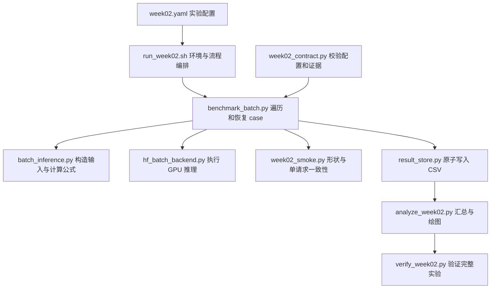

# Week 2 代码导读：固定 Batch 的推理、计时与显存

Week 2 把 Week 1 的单请求 greedy decoding 扩展成真正的批量前向计算：同一批请求一起
prefill，然后在固定 batch 内一起 decode。核心问题是 prompt 长度、生成长度和 batch size
分别怎样影响吞吐、延迟和显存。本周没有在线请求队列，也没有 HTTP 服务。

配套阅读：[执行计划](week-02-plan.md)、[参考资料](week-02-references.md)、
[Week 3 代码导读](week-03-code-walkthrough.md)、[Week 2–4 代码 review](week-02-04-code-review.md)。
本文解释当前源码；CPU 测试通过不代表已完成 GPU 实验。

## 1. 先看实验边界

[配置](../configs/week02.yaml) 固定模型及 revision、`bfloat16`、greedy decoding 和
`use_cache=true`。三个 sweep 每次只改变一个变量：

| Sweep | 改变的值 | 固定条件 | 实验点数 |
|---|---|---|---:|
| `prompt_length` | prompt = 32、256、1024、2048 | batch=1，output=64 | 4 |
| `output_length` | output = 16、64、256 | batch=1，prompt=256 | 3 |
| `batch_size` | batch = 1、2、4、8、16 | prompt=256，output=64 | 5 |

共 12 个带 sweep 身份的实验点，每点 5 次正式 repeat，共 60 个 case。
部分点的输入 shape 相同，但属于不同 sweep，不能擅自去重。每个待执行的 workload
先做 2 次 warmup；warmup 不写入正式 CSV。

## 2. 模块分工与调用链



| 文件与入口 | 职责 | 阅读时关注什么 |
|---|---|---|
| [benchmark_batch.py](../src/benchmark_batch.py) `main` | 读取配置、绑定运行身份、smoke、warmup、遍历 case、记录失败 | 哪些结果能跳过，哪些失败会中断 |
| [batch_inference.py](../src/batch_inference.py) | 纯 Python 的定长 token、padding、mask、计时公式 | 输入 shape 与指标公式，不依赖 Torch |
| [hf_batch_backend.py](../src/hf_batch_backend.py) `run_batched_greedy_generation` | 模型加载、H2D、prefill、decode、显存采样 | 真正执行 GPU 工作的位置 |
| [week02_smoke.py](../src/week02_smoke.py) | batch 形状、生成 token、hash 和 Week 1 parity | 防止“batch 参数变了，实际仍只跑一行” |
| [week02_contract.py](../src/week02_contract.py) | case key、45 列 raw schema、身份和跨字段方程 | 数据是否完整、自洽且来自同一次实验 |
| [result_store.py](../src/result_store.py) `append_row` | 临时文件、fsync、atomic replace | 中断时保留已提交的完整行 |
| [analyze_week02.py](../src/analyze_week02.py)、[verify_week02.py](../scripts/verify_week02.py) | 从原始数据生成结果，再重新验证 | “生成了图”与“实验已验收”的区别 |

建议按 `配置 → benchmark main → 输入构造 → GPU loop → contract → analysis/verifier`
阅读。这样可以先理解推理主线，再理解围绕主线的证据管理。

## 3. 一个 Batch 怎样进入模型

`build_exact_length_batch()` 把 prompt 编码后重复、截断到指定 token 数，得到
`[batch_size, prompt_tokens]`。这是用于控制计算量的合成输入，不代表自然语言内容质量。

- 第 0 行保留原始 prompt，方便 batch=1 与 Week 1 的输入一致。
- 后续行加上 `Synthetic request NN.` 前缀，再定长化，使请求内容具有确定性差异。
- `build_static_batch()` 负责 padding 和 mask：真实 token 为 1，padding 为 0。
- `prepare_batch_tensors()` 将列表转换为 CPU `torch.long` tensor，再由 backend 复制到 GPU。

正式矩阵所有行等长，所以通常不会产生真实的 padding 空洞。纯 Python 层测试了
left/right padding，并不等于已经验证任意变长、左右 padding 的 GPU 推理语义；未来扩展
变长 batch 时，还要检查模型的 `position_ids`、cache 位置和逐请求输出一致性。

## 4. Prefill 与 Decode 的关键实现

`load_hf_batch_model()` 在调用时才导入 Torch 和 Transformers，加载固定 revision，
使用 `cuda:0`，并执行 `model.eval()`。实际生成在 `torch.inference_mode()` 内完成。

一次生成可按下面的顺序读：

```text
CPU 输入 [B, P]
  → H2D
  → model(input_ids, attention_mask, use_cache=True)
  → 从每行最后一个有效 prompt 位置取 logits，分别 argmax
  → 得到第一个 token [B, 1]，保存 past_key_values
  → 重复 O-1 次：追加 mask=1，用上一个 token 和 cache 做 forward，再 argmax
  → 生成结果 [B, O] 复制回 CPU，计算 token hash
```

`_select_prompt_tokens()` 按每一行的 mask 找最后一个有效位置；decode 阶段直接读取
`logits[:, -1, :]`。这两个位置选择逻辑不同，不能机械地统一成取最后一列。

整个 decode 期间 batch 成员固定。循环严格运行到指定输出长度，没有遇到 EOS 就提前
退出的分支，因此成功结果的总输出 token 数是 `B × O`。这有利于控制计算量，但与真实
聊天服务按 EOS 结束的行为不同。

## 5. 计时边界：字段名必须配合公式理解

`_measure_cuda()` 用 `perf_counter()` 计时，并在被测调用前后执行 CUDA synchronize。
它测到的是包含 CPU 调用开销的同步区间，不是 CUDA event 意义上的纯 kernel 时间。

| 字段 | 当前实现的测量或计算方式 |
|---|---|
| `preprocessing_ms` | tokenize、定长构造、padding/mask 和 CPU tensor 创建 |
| `h2d_ms` | input IDs 和 attention mask 复制到 GPU |
| `gpu_ttft_ms` | 第一次 model forward；首次 token 的位置选择和 argmax 在此计时之外 |
| `e2e_ttft_ms` | `preprocessing + h2d + gpu_ttft` |
| `mean_tpot_ms` | 后续 `O-1` 个 decode 区间的平均值 |
| `p95_itl_ms` | 这些 decode 区间的 nearest-rank P95 |
| `generation_ms` | `gpu_ttft + sum(decode_step_ms)` |
| `e2e_latency_ms` | `preprocessing + h2d + generation` |
| `output_tokens_per_second` | `B × O / (generation_ms / 1000)` |
| `requests_per_second` | `B / (generation_ms / 1000)` |

decode 的被测闭包包含 mask 扩展、model forward 和 argmax；每步累积输出的
`torch.cat([generated, next_token])` 在闭包外。首次 argmax、这些输出拼接、最终 D2H、
hash 和部分 Python bookkeeping 不在上述分段加总内。因此 `e2e_latency_ms` 是按契约
相加得到的延迟，不是从函数入口到返回的完整墙钟时间，更不是 HTTP 客户端延迟。

`mean_tpot_ms` 和 `p95_itl_ms` 都描述整批同步 decode 的间隔，不是跨在线请求的尾延迟。
若只生成 1 个 token，没有 decode 区间，相关字段应为空。

## 6. 理论 KV Cache 与实际显存为何不同

模型加载后，`capture_model_memory_baseline()` 同步 GPU、清理 allocator cache，再记录
allocated/reserved baseline。每次生成前清理缓存、重置 peak stats，结束时读取峰值。

[kv_cache_estimator.py](../src/kv_cache_estimator.py) 的理论值为：

```text
KV bytes = 2 × layers × kv_heads × head_dim × (P + O - 1) × B × dtype_bytes
```

乘 2 对应 K 和 V；GQA 模型使用 `num_key_value_heads`，不是 attention query heads。
`head_dim` 优先读取显式配置，否则由 hidden size 和 attention heads 推导。
长度是 `P+O-1`，因为最后一个输出 token 生成后没有再次输入模型，尚未为它建立 KV。

实际显存还包括权重、logits、临时 tensor 和 allocator 管理开销。`allocated` 表示正在
使用的分配，`reserved` 表示 allocator 保留的空间，二者的 baseline delta 都不应直接
当作 KV 大小。当前 loop 在 decode 期间还保留 `prefill_output`，其中的 prompt logits
也是阅读显存结果时要注意的实现开销。字段后缀虽为 `_mb`，换算实际使用 `1024²`，即 MiB。

## 7. Smoke、失败与恢复

正式 CSV 写入前，`run_preformal_smoke()` 检查 batch 1、2、4 的 input/mask/output shape，
保存完整生成 token ID、逐请求及整体 SHA-256，并要求 batch=1 与
`src.inference.run_greedy_generation()` 的输出完全一致。smoke/parity 失败会阻止正式测量。
恢复时已有 smoke 也要重新校验，不能仅凭文件存在就通过。

正式 case 的 key 是 `(sweep, batch_size, prompt_tokens, output_tokens, repeat)`。
runner 先验证已有全部行，再跳过已提交的 terminal case：

| 状态 | 保存什么 | 正式验收规则 |
|---|---|---|
| `completed` | 延迟、吞吐、显存、输出 token hash | 必须满足字段间方程和身份一致性 |
| `oom` | 异常类型/阶段/信息、可获得的显存；延迟吞吐为空 | 同一点 5 次全 OOM，且构成 sweep 中成功点之后的单调 suffix，才可作为容量边界 |
| `error` | 失败证据，延迟吞吐为空 | 保留但不能通过验收 |

success/OOM 混合不能取成功子集当作有效聚合。warmup 普通异常直接中断，不伪造 5 次正式
失败；warmup OOM 后仍逐个执行正式 repeat，实际确认容量边界。

`append_row()` 每次重写已有行加新行，再原子替换。适用于这里的小矩阵和单个 writer，
不能当作支持并发写入的大规模日志系统。进程中断后从缺失 case 恢复；已经记录的 `error`
也是 terminal row，重启不会自动重测它。若要修正代码后重测，应保留旧证据并创建新运行。

## 8. 从 Raw 数据到最终验收

默认结果根为 `results/week02/`：

```text
environment.json / dependency-freeze.txt / model-snapshot.json
smoke.json
raw/run_metadata.json + raw/batch-sweeps.csv
  → summary.csv + figures/*.png
  → analysis.json
  → reports/week02.md
  → verification-receipt.json + run-status.json
```

`analyze_week02.py` 要求完整 60 行并通过 completion contract，按 workload 汇总 5 次
repeat 的 median 和 nearest-rank P95。只有 5 个样本时 P95 就是最大值；
`p95_p95_itl_ms` 是“5 次运行各自 P95 ITL 的 P95”，不是把所有 token interval 合并后的 P95。
全部 OOM 的点不生成延迟/吞吐聚合。

四张图的文件名固定为：

- `prompt-length-vs-ttft.png`
- `output-length-vs-e2e-latency.png`
- `batch-size-vs-token-throughput.png`
- `batch-size-vs-latency-memory.png`

`analysis.json` 绑定 raw、metadata、smoke、summary 和图片的 hash，也保存从 summary 与
model/dtype/GPU 上下文得到的绘图输入 hash。verifier 重算 summary、核对证据身份，并检查
报告中的 `WEEK02-EVIDENCE` block 与未填写 marker。文件完整和报告完成都满足后，才写入
验收 receipt 并把状态置为 `completed`。

## 9. 运行与阅读测试

在已经准备好 `.venv` 和 CUDA 的 GPU VM 上运行：

```bash
make run-week02 PYTHON=.venv/bin/python
```

脚本会准备 pinned model snapshot、检查环境、执行或恢复 benchmark、生成分析，最终状态
为 `artifacts_ready`。结果同步回本地、停止 VM 并填写真实报告后，再执行：

```bash
make verify-week02 PYTHON=.venv/bin/python
```

与主线最相关的测试是 [test_batch_inference.py](../tests/test_batch_inference.py)、
[test_week02_smoke.py](../tests/test_week02_smoke.py)、
[test_week02_contract.py](../tests/test_week02_contract.py)、
[test_week02_analysis.py](../tests/test_week02_analysis.py) 和
[test_result_store.py](../tests/test_result_store.py)。它们验证公式、输入和证据契约；GPU
输出一致性、实际显存和性能仍由 VM 上的 smoke 与正式实验确认。

本次 review 没有确认新的 Week 2 主流程阻断问题；最需要保留的解释是计时边界、P95 的
样本层级、OOM 验收规则，以及“支持 padding 的输入构造”不等于“已测变长 GPU batch”。
