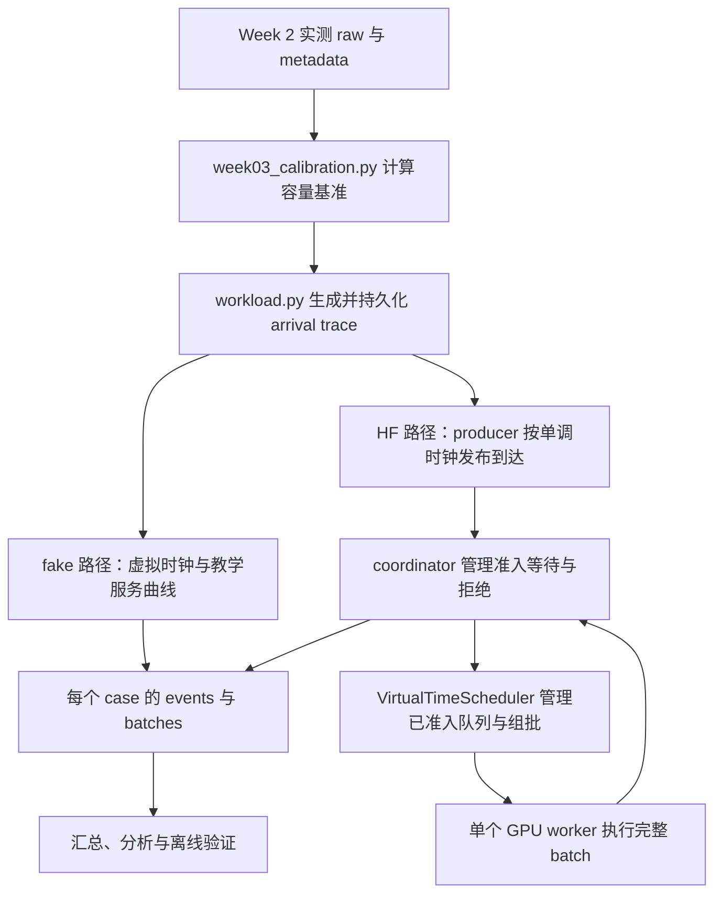

# Week 3 代码导读：请求队列、动态组批与单 GPU Worker

Week 3 在 Week 2 的固定 batch 推理函数外，增加可复现的请求到达过程、排队、准入和
组批策略。调度器决定“哪些请求组成下一批”，一旦交给 GPU，成员在整个 decode 期间
保持不变。这是 request-level batching；vLLM 的 iteration-level continuous batching
到 [Week 4](week-04-code-walkthrough.md) 才引入。

配套阅读：[执行计划](week-03-plan.md)、[参考资料](week-03-references.md)、
[Week 2 代码导读](week-02-code-walkthrough.md)、[代码 review](week-02-04-code-review.md)。
下文同时说明当前实现及其限制，不把 fake simulation 当成 GPU 性能证据。

## 1. 架构中每一层负责什么



| 文件与入口 | 主要职责 |
|---|---|
| [week03_calibration.py](../src/week03_calibration.py) | 验证 Week 2 raw/metadata，提取 measured capacity，并绑定模型、runtime 与输入证据 |
| [workload.py](../src/workload.py) `generate_poisson_trace` | 根据 seed、到达率、时长和请求 shape 生成便携的 trace |
| [prepare_week03_run.py](../scripts/prepare_week03_run.py) | 在日志、校准和 HF 前置步骤之前解析完整输出路径，保存本次 `run-config.json` |
| [dynamic_batcher.py](../src/dynamic_batcher.py) `VirtualTimeScheduler` | 纯组批状态机，不拥有线程、时钟、模型或 GPU |
| [serve_week03.py](../src/serve_week03.py) `run_matrix` | 选择 backend、生成 trace、恢复 case、重建汇总 |
| 同文件 `simulate_case` / `run_online_case` | 分别驱动虚拟时钟与真实单调时钟，管理请求生命周期 |
| 同文件 `HFBatchBackend.execute` | 复用 Week 2 GPU loop，执行一个固定成员的 batch |
| [week03_contract.py](../src/week03_contract.py) | case、trace、身份、时间戳及 events/batches 之间的一致性规则 |
| [analyze_week03.py](../src/analyze_week03.py) | 请求级统计、队列重建和四张图 |
| [verify_week03.py](../scripts/verify_week03.py) | 重建正式 55-case 证据并验证报告与产物 |

阅读顺序建议为 `CaseKey / TraceRequest → SchedulerConfig → VirtualTimeScheduler →
simulate_case → run_online_case → HFBatchBackend → summarize_case`。
先理解无线程的调度语义，再读真实并发路径会更清楚。

## 2. 负载从哪里来：先校准，再固定 Trace

[配置](../configs/week03.yaml) 固定请求 shape 为 prompt=256、output=64。
`week03_calibration.py` 从完整且通过数据契约校验的 Week 2 batch-size sweep 中，选择
batch=1 的 E2E 延迟，重算每个 repeat 的 requests/s，再取 median 作为 `capacity_rps`，
并保存配置要求的其他 batch 测量证据。这里校验的是 Week 2 数据及身份，不等于替代
Week 2 的完整报告验收。

```text
capacity_rps = median(1 / (batch1_e2e_latency_ms / 1000))
arrival_rate_rps = offered_load_ratio × capacity_rps
```

校准没有直接复制 Week 2 以 `generation_ms` 为分母的 `requests_per_second`，而是把
preprocessing 和 H2D 纳入分母。不过它仍继承 Week 2 分段 E2E 的计时边界，且不包含
Week 3 调度开销；`offered_load_ratio=1` 不保证恰好等于在线服务的饱和点。

`trace_key(case)` 只包含 profile、load ratio 和 repeat，不包含 policy、batch size 或
delay。相同 trace key 的所有策略使用同一批请求、同一请求顺序和到达偏移。base seed
与 trace key 共同派生实际 seed，trace 在正式 case 前写盘并计算 fingerprint。

时间戳是相对于 case 起点的纳秒偏移，可以跨进程重放。HF producer 使用
`time.monotonic_ns()` 映射到本次运行的起点，避免墙钟调整影响持续时间。
prompt 内容也由 request ID 确定：

```text
Trace request <request_id>. <base prompt>
  → 编码、重复、截断到 256 tokens
```

组批改变不会改变某个请求的 token IDs；Week 4 replay 复用这一构造规则。

## 3. 三种组批策略

| 策略 | 触发条件 | 需要注意的边界 |
|---|---|---|
| `no_batching` | 单请求 FIFO，GPU 空闲时立即交付 | 不等于没有排队；GPU 忙时仍要等 |
| `fixed_window` | 窗口边界锚定 case 时间零点，到边界取一批 | 不因 batch 满而提前触发；真实 worker 忙时跨过的窗口会被跳过 |
| `size_or_time` | 达到最大 batch size，或最老已准入请求的 deadline 到期 | deadline 从 `admitted_ns` 起算；不保证 GPU 忙时仍能按时开始 |

`submit()` 只负责准入；`advance_to(t)` 推进时间并返回可派发 batch。
`dispatch_slots=0` 表示 worker 忙，`dispatch_slots=1` 表示最多交付一批。
`close()` 用 `shutdown` trigger 排空剩余已准入请求，包括最后一个未满 batch。

同一时刻的到达先进入状态机，再处理 flush；相同到达时间保留 trace ordinal 顺序。
例子：最大 batch=3，最大等待=5 ms，且 worker 可用：

```text
到达：A@0、B@2、C@5、D@8 ms
派发：[A,B,C]@5 ms，C 先到达，随后按 size 触发
      [D]@13 ms，按 D 的 admitted time + 5 ms 触发
```

这个例子解释策略本身。真实模式下 worker 的忙闲、准入等待和线程调度会改变实际派发时间，
不能拿理论 deadline 当作已经发生的 GPU 开始时间。

## 4. HF 路径的线程、队列和背压

`run_online_case()` 有三个执行角色：

1. **Producer 线程**按 trace 时间发布 `_ArrivalGroup`，记录实际 observed arrival。
   它不等准入队列腾出空间，因此前面的饱和请求不会阻塞后续请求的到达观察。
2. **Coordinator 所在线程**处理到达和完成通知，维护 FIFO `pending_admissions`，
   检查各请求 deadline，并驱动 scheduler。
3. **Worker 线程**从 `work` 队列接收一个 batch，调用 `backend.execute()`，再通知完成。
   同时只执行一批；不会在 GPU 后面额外堆积一串已经形成的 batch。

默认 `queue_capacity=128` 约束的是 scheduler 中已准入但尚未派发的请求。
`work` 的队列容量为 1，代表单 worker 的交接槽。到达通知队列和待准入队列不受这个 128
限制，所以不能把它解释为整个进程最多保存 128 个请求。

队列满后，请求进入 `pending_admissions`，每个请求有独立的
`observed_arrival_ns + admission_timeout_ns`，默认超时为 50 ms。空间释放后按 FIFO
尝试准入；超时的请求记为 `rejected`，没有 admission 或 GPU 生命周期。

HF 路径用实际 handoff 时间覆盖调度器可能返回的历史派发时间，避免把一个迟到的派发
伪装成按时发生。`worker_became_available_timeout` 等 trigger 用来解释 worker 忙导致
deadline 延后。`queue_depth_at_dispatch` 是取走当前 batch 后剩余的队列深度。

## 5. 一个请求的时间线与指标

```text
scheduled_arrival
  → observed_arrival
  → admitted
  → dispatch
  → gpu_start
  → first_token
  → finished / terminal
```

| 字段 | 公式或含义 |
|---|---|
| `arrival_lag_ns` | observed − scheduled，producer 的到达观察延迟 |
| `admission_wait_ns` | admitted − observed，进入有界队列前的等待 |
| `queueing_delay_ns` | dispatch − admitted，已准入队列中的等待 |
| `worker_wait_ns` | gpu_start − dispatch，交接给 worker 的等待 |
| `service_time_ns` | finished − gpu_start，worker 内的完整执行时间 |
| `ttft_ns` | first_token − admitted |
| `e2e_latency_ns` | finished − admitted |

这里的 `gpu_start_ns` 实际是 worker 开始执行 backend 的时间，**包含随后进行的 CPU
tokenization、H2D 和 GPU 计算**，不是第一条 GPU kernel 的开始时间。
`HFBatchBackend.execute()` 的 service time 用完整单调时钟区间记录，包含结果复制与 hash。

HF 没有真正向客户端流式发送首 token。`first_token_ns` 是以 worker 起点加上 Week 2
`e2e_ttft_ms` 重建的内部时间，继承其首次 argmax 等操作不在计时内的限制。它与 Week 4
客户端首次收到非空 SSE 内容的时间具有不同观察边界。

另外，本周 TTFT/E2E 从 **admitted** 起算，不包含 arrival lag 和 admission wait。
分析过载时需要同时看拒绝率、准入等待和原始时间戳，不能只看已完成请求的 P99。

## 6. Fake 与 HF 的用途

`FakeBatchBackend` 按 batch size 查配置中的教学服务时间，并用固定比例计算首 token
偏移。`simulate_case()` 直接跳到下一次到达、deadline 或完成事件，不 sleep，也不导入
Torch。这条路径适合检查 FIFO、同时到达、队列满、失败和恢复的语义。

HF 则按真实时钟工作，调用与 Week 2 相同的定长、cache-on GPU loop。两条路径分别由
`simulate_case()` 与 `run_online_case()` 驱动；fake 的数值和真实线程时序都不能代替 GPU
测量。HF backend 当前只接受同一批内相同 prompt/output shape。

## 7. 实验规模、统计分母与读图限制

| Profile | Case 数 | 用途 |
|---|---:|---|
| `primary` | 55 | 5 个 load × 3 个 policy × 3 repeats，再加去重后的 10 个参数扫描 case |
| `smoke` | 3 | 每个 policy 配置最多 20 个请求、30 s 到达窗口，只检查链路 |
| `extended` | 87 | 扩展 delay 扫描，需显式选择 |

primary 每个 trace 的到达窗口为 120 s，其中前 20 s 为 warmup，统计窗口为 100 s。
warmup 请求影响队列和 worker 状态，但不计入正式请求分母。120 s 约束到达窗口，**不是
case 执行超时**；最后的请求可能还需要 drain，实际耗时会超过 `55 × 120 s` 的 1.83 小时。

`summarize_case()` 当前采用：

```text
achieved_throughput_rps = 最终完成的 measurement 请求数 / 100 s
drain_inclusive_throughput_rps
    = 同一完成数 / (max(声明窗口结束时间, 最后一个 measurement terminal 时间) - warmup 结束时间)
completion/rejection/failure rate = 各状态数 / 全部 measurement 请求数
latency percentiles = 仅 completed measurement 请求的延迟分位数
```

`achieved_throughput_rps` 的分子包含窗口结束后才完成的请求，所以它不等于“100 秒窗口
内部完成的实时吞吐”。过载时应同时解释 drain 指标；drain 分母至少覆盖完整声明窗口。
summary 显式记录 `measurement_start_ns`、`measurement_end_ns` 和 `drain_duration_seconds`，
Week 4 replay 使用相同窗口定义，并在对比时核对分母和完成数。

四张图是 `offered-load-vs-throughput.png`、`offered-load-vs-p95-p99-ttft.png`、
`batch-window-vs-fill-and-queue-delay.png` 和 `queue-depth-over-time-overload.png`。
队列图从 admitted/dispatch 事件重建，仅表示已准入队列。

前两张图先按 `matrix.policy_defaults` 筛选固定 batch size/delay，再按 policy 和 load
聚合。默认 primary 的 55 行中，45 行用于主负载曲线；额外扫描点用于参数图，不会改变
固定参数曲线。Week 4 loader 复用相同筛选函数，并保留 case/batch/delay 身份，见
[R3 修复记录](week-02-04-code-review.md#r3)。

## 8. 结果提交、恢复和验收

每个 case 独立写入 `raw/cases/<case-id>/`：

```text
events.csv   请求身份、状态、时间戳和可重算时长
batches.csv  成员 ID、trigger、fill ratio、worker 生命周期
complete.json  最后写入，绑定上述两份 CSV 的 hash 与 case/run 身份
```

`_case_is_complete()` 同时验证 marker、hash、身份及两个 CSV 的交叉约束，才允许跳过。
中断或不完整的 case 整体重跑；不在半个 batch 中继续。所有完整 case 按确定顺序重建
aggregate `raw/events.csv` 和 `raw/batches.csv`，避免把追加次数当成样本数。

正式 verifier 只接受 canonical root 下的 `primary + hf`。它检查 measured calibration、
模型/runtime/source、环境和依赖证据、完整 case 集、逐请求与 batch 对应关系、汇总、
分析产物和报告；fake、smoke、失败 HF batch 或部分 case 都不能宣告本周完成。

shell 先调用 `prepare_week03_run.py` 生成完整的 effective config，再开始日志和 HF
前置步骤。重定位覆盖 case/trace/aggregate、metadata/status、环境、freeze、snapshot、
分析、报告和日志；Make 入口要求生成 calibration 时也写入对应根目录。非正式运行不能
把根目录指向正式目录内部，隔离运行的显式日志路径也必须留在自己的根目录。
直接调用 shell 且未设置 `CALIBRATE=1` 时，已有 calibration 作为只读输入使用。
详细见 [R5](week-02-04-code-review.md#r5)。

## 9. 执行入口与调试顺序

已有普通 Python 环境时，可以先运行纯 CPU 模拟：

```bash
make simulate-week03 PYTHON=.venv/bin/python
```

`Makefile` 为 simulation 显式设置输出根和日志目录。若需要分段验证恢复逻辑：

```bash
PYTHON=.venv/bin/python PROFILE=primary BACKEND=fake MAX_CASES=3 \
  OUTPUT_ROOT=results/week03-simulation RUN_LOG=results/week03-simulation/logs/week03.log \
  bash scripts/run_week03.sh
```

再次执行时去掉 `MAX_CASES`，会补齐缺失 case 后分析。`MAX_CASES` 限制的是本次新增执行
的 case 数，不是 trace 中请求数。

GPU 路径的 Make 入口先确定输出目录，再从 Week 2 数据生成 calibration：

```bash
make smoke-week03 PYTHON=.venv/bin/python
make run-week03 PYTHON=.venv/bin/python
```

smoke 完成后写出三种策略的 `summary.csv` 和 `analysis.json`，其中 `figures=[]`，
不会要求 1.05 负载的过载图。primary 仍生成完整四张图。shell 使用带 `pipefail` 的
日志管道，等待日志写完并保留前置步骤或 runner 的失败退出码，见 [R6](week-02-04-code-review.md#r6)。
结果同步、停止 VM、填写报告后，在普通环境验收：

```bash
make verify-week03 PYTHON=.venv/bin/python
```

调试时依次检查 trace → admitted/rejected → batch membership → worker 时间线 → summary。
相关测试集中在 [test_dynamic_batcher.py](../tests/test_dynamic_batcher.py)、
[test_workload.py](../tests/test_workload.py)、
[test_week03_contract.py](../tests/test_week03_contract.py)、
[test_week03_calibration.py](../tests/test_week03_calibration.py) 和
[test_week03_analysis.py](../tests/test_week03_analysis.py)。
输出隔离、完整 smoke 入口与跨周统计回归见
[test_week03_review_regressions.py](../tests/test_week03_review_regressions.py)。

当前 HF runner 没有 Week 4 那样的进程组 watchdog；worker 卡住时，`work.join()` 等待
可能无法有界结束。准入超时只限制准入等待，不限制 GPU 执行或整个 case 的时长。
