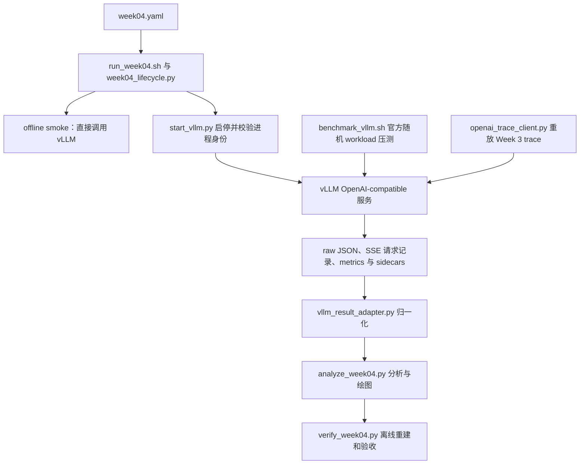

# Week 4 代码导读：vLLM 服务、压测与跨周对比

Week 4 把模型执行交给固定版本的 vLLM，仓库代码负责启动服务、发送请求、采集指标、
归一化结果和验证实验。与 Week 3 相比，组批和 KV 管理由 vLLM engine 内部完成；本周
代码没有自己实现 continuous batching，也没有引入集群路由或多副本控制面。

配套阅读：[执行计划](week-04-plan.md)、[参考资料](week-04-references.md)、
[Week 3 代码导读](week-03-code-walkthrough.md)、[代码 review](week-02-04-code-review.md)。
本文说明 review 修复后的实现；除了证据文件完整性，还要检查配置是否生效、统计窗口、
参数分组和重复实验是否满足对比条件。

## 1. 整体架构与两条测量路径



两条测量路径回答不同问题：

- **官方 benchmark matrix**：使用 `vllm bench serve` 的 random dataset，测不同请求
  shape、并发度和请求到达率下的 vLLM baseline。
- **Week 3 trace replay**：使用原来的请求 ID、token IDs、到达偏移及 warmup 标记，
  控制输入后比较两种 serving 实现。

相同 token 长度不等于相同 prompt 或相同到达 trace，不能用随机 matrix 代替 replay A/B。

## 2. 代码阅读地图

| 模块 | 职责与主要入口 |
|---|---|
| [vllm_contract.py](../src/vllm_contract.py) | `validate_config`、`expand_cases`、`server_argv`、`benchmark_argv`：把配置变成稳定 case 和命令参数列表 |
| [week04_contract.py](../src/week04_contract.py) | run/source/config/runtime/model 身份、artifact identity、server attempt 和资源审计规则 |
| [week04_lifecycle.py](../scripts/week04_lifecycle.py) | 初始化 run、写 manifest、更新状态、创建待填写审计模板 |
| [start_vllm.py](../scripts/start_vllm.py) | 版本和 CLI 能力检查、启动、readiness、进程所有权、停止与端口关闭 |
| [vllm_offline_smoke.py](../src/vllm_offline_smoke.py)、[openai_smoke.py](../src/openai_smoke.py) | 分别验证直接模型生成、普通 HTTP 与 SSE 生成 |
| [benchmark_vllm.sh](../scripts/benchmark_vllm.sh) | 官方 CLI 压测、超时监督、metrics 和原始结果提交 |
| [openai_stream.py](../src/openai_stream.py) | 标准库 HTTP/SSE 传输、增量解码、协议校验、超时与错误清理 |
| [openai_trace_client.py](../src/openai_trace_client.py) | 验证 Week 3 来源、重放 trace、记录请求与客户端背压 |
| [vllm_result_adapter.py](../src/vllm_result_adapter.py) | 将固定版本 raw JSON 和 Prometheus snapshot 转成仓库 schema |
| [analyze_week04.py](../src/analyze_week04.py)、[verify_week04.py](../scripts/verify_week04.py) | 分析与 SLO 选点；从 raw/sidecars 重建结果并最终验收 |

建议先读 `vllm_contract → run_week04.sh → start_vllm/benchmark wrapper → adapter →
trace client → analysis/verifier`。SSE parser 和进程身份实现可在需要理解边界条件时再深入。

## 3. 环境与配置边界

Week 1–3 使用 `.venv`；Week 4 使用独立 `.venv-vllm`，
[requirements-vllm.txt](../requirements-vllm.txt) 固定 `vllm==0.10.2`。
[bootstrap_vllm_gcp.sh](../scripts/bootstrap_vllm_gcp.sh) 归档安装前 GPU/Python 信息、
解析后的依赖集、vLLM version 及 CLI help，避免新环境改变前几周实验依赖。

[配置](../configs/week04.yaml) 固定 model revision、dtype、服务端参数与 workload。
服务端默认只监听 `127.0.0.1:8000`，正式请求在 VM 内发出。主要参数含义是：

| 参数 | 当前配置 | 含义 |
|---|---:|---|
| `max_model_len` | 4096 | 请求上下文长度上限 |
| `gpu_memory_utilization` | 0.85 | vLLM 规划可使用显存的比例，不是实测显存利用率 |
| `max_num_seqs` | 16 | engine 调度的序列数量上限，不等于客户端最大并发 |
| `max_num_batched_tokens` | 4096 | 每轮调度的 token budget，不是 batch 中请求数 |
| `enable_prefix_caching` | false | 显式生成 `--no-enable-prefix-caching`，关闭前缀缓存 |

`server_argv()` 根据严格的 boolean 配置显式生成开启或关闭参数；字符串 `"false"` 会被
拒绝。vLLM 0.10.2 的 V1 生成路径默认开启 prefix caching，所以省略参数不等于关闭。
已安装 help 的能力检查、保存的 argv 和 verifier 都包含这一显式开关，见
[R1](week-02-04-code-review.md#r1)。实际 GPU/engine 行为仍需在正式运行中确认。

config fingerprint 排除了顶层 `output` 与 server 中的文件路径，但
`benchmark.comparison` 内的来源路径仍在 scientific config 中。迁移来源路径时应检查
实际 fingerprint，不能假设所有路径都不会影响恢复身份。

## 4. 运行身份与进程身份为什么分开

正式运行在 GPU 工作前创建 `run-metadata.json`，其中保存：

- `run_id`：逻辑实验 UUID。
- source inventory/fingerprint：关键源码、配置和依赖文件的内容身份。
- scientific config fingerprint：实验设置的身份。
- runtime/model identity：软件、GPU、模型和 revision。

服务生命周期还增加 `server_instance_id` 和每次实际启动都变化的 `server_attempt_id`。
同一个逻辑 run 不应悄悄混入两个服务进程产生的证据：readiness、HTTP smokes、benchmark
smoke、正式 case 和 replay 都必须绑定同一 attempt。

一旦旧 attempt 已产生 readiness 或已完成的 server-backed evidence，重新启动会被拒绝。
此时应归档旧 run 并初始化新 run。恢复 case 与重启服务是两件事；单 case wrapper 可以
复用同一仍有效 attempt 的完整结果，但不能据此推断整个 `--gpu` 脚本可跨服务重启续跑。

## 5. GPU 阶段怎样执行

[run_week04.sh](../scripts/run_week04.sh) 的顺序是：

```text
validate → initialize run → write manifest
  → offline smoke
  → start server + readiness
  → nonstream / stream HTTP smokes
  → benchmark smoke
  → 72 个正式 benchmark cases
  → Week 3 trace replay
  → stop server
  → gpu_artifacts_ready
```

offline smoke 在函数内才导入 vLLM，直接调用 `LLM.generate()`；它的 elapsed time 包含
engine 启动，不能当作稳态 latency。HTTP smoke 分别验证普通 JSON response 和流式输出。
`/health` 与 `/v1/models` 可用只证明服务 ready，生成 smoke 才进一步验证真实推理链路。

`start_vllm.py` 为启动建立独立进程组，记录 PID、OS 进程起始身份和实际 argv。停止前
复核所有权，向所属进程组发送信号，并确认进程组退出及端口关闭，防止 stale PID 或
遗留 engine worker。非 loopback bind 需要显式参数确认。

[process_watchdog.py](../src/process_watchdog.py) 为受监督的子进程设置单调时钟期限，
超时后先 TERM，再在 grace period 后 KILL。GPU 阶段有退出清理；这里停止的是本次
vLLM 服务，停止云 VM 和核对残留计费资源属于后续外部操作。

## 6. 官方 Benchmark：负载模式与结果提交

`expand_cases()` 当前生成 72 个 case：

| 模式 | Workload / 负载 | Case 数 |
|---|---|---:|
| closed-loop | short-chat、balanced、long-context、generation；concurrency=1/2/4/8/16；各 3 repeats | 60 |
| open-loop | balanced；request rate=1/2/4/8 rps；各 3 repeats | 12 |

closed-loop 使用 `request-rate=inf` 加 `max-concurrency`，空出并发槽后继续发送；open-loop
使用有限 request rate、不设该并发上限。两者的横轴不同，不能把 concurrency=4 当成 4 rps。

每个正式 case 有 200 个 prompt；固定 token shape 使用 `--random-range-ratio 0`。
`--ignore-eos` 保持指定生成长度。mixed workload 虽在配置中声明，目前未加入 primary。
`warmup_requests=20` 当前用于单独的 benchmark smoke 请求数，不是每个 case 内额外剔除
20 条 warmup 样本。

wrapper 保存精确 argv、已安装 CLI help、stdout、watchdog 和前后 metrics snapshot，
并请求官方 CLI 输出 detailed JSON，不从终端文字抽取性能数字。提交过程为：

```text
写 incomplete marker → 在临时目录执行 benchmark
  → exit code=0 且结果是合法 JSON
  → 发布 raw JSON 与 completion marker
  → 后续 adapter/verifier 再验证字段和科学语义
```

合法 JSON 不等于所有请求成功，也不等于统计口径正确。失败和中断保留未完成标记及日志，
正式 verifier 会拒绝它们。completion marker 绑定 raw 和 sidecars 的 SHA-256。

## 7. SSE 与精确 Trace Replay

`openai_stream.py` 不依赖 OpenAI SDK。`SSEParser` 使用增量 UTF-8 解码，处理跨网络分片的
字符、CR/LF/CRLF、多行 data、注释和 `[DONE]`；网络读取块不等于一条完整 SSE event。
实现分别限制行、event、HTTP body、单次 socket 操作和整个流的时长，并清理错误中的敏感值。

`configured_replay_cases()` 在重放前调用 Week 3 的只读 verifier，并检查它与已完成
receipt/status 一致。随后按唯一 trace/rate/repeat 重放，而不是为每个 Week 3 policy
重复生成随机请求。model、revision、dtype、base prompt 和 256/64 token shape 必须一致。

`execute_trace()` 预先生成 token IDs，用 semaphore 和 thread pool 控制最多 128 个
submitted requests，再按原始偏移发送。客户端满载会阻塞提交，所以记录中同时保存
`capacity_wait_ns`、executor 等待、实际 request start 和 `arrival_lag_ns`。measurement
请求的 P99 arrival lag 超过默认 100 ms 时，comparison gate 拒绝该 replay。

`run_one()` 将首个非空内容 chunk 作为客户端首 token，检查 `[DONE]` 和 usage，核对实际
prompt/output token 数。请求结果分 `completed`、`timeout`、`error`，warmup 请求单独计数。

## 8. 指标解释及跨周可比性的边界

| 指标 | 当前计算边界 |
|---|---|
| replay TTFT | 第一个非空 SSE 内容时间 − executor 提交时间，包含 executor 等待 |
| replay TPOT | `(流结束时间 − 首内容时间) / (actual_output_tokens − 1)`，是均摊值 |
| replay E2E | 流结束时间 − executor 提交时间 |
| `network_e2e_ms` | 流结束时间 − 请求 worker 开始时间，不是纯网络传输耗时 |
| `server_queue_ms` | Prometheus queue histogram 的 `Δsum / Δcount × 1000`，是本 case 的均值 |

流结束时间包含收尾/usage/`[DONE]` 开销，不能把 replay TPOT 当成逐 token ITL 的 P99。
queue 图汇总的是各 repeat 的 queue 均值再取 median，不是 server queue P95/P99。

Week 3 的 TTFT 从 admitted 起算、首 token 时间由内部测量重建；Week 4 则观察 HTTP/SSE。
相同 trace 只控制输入，没有消除这些测量边界差异。比较时要说明 HTTP 栈、client 等待、
tokenization 所在阶段和首 token 定义，不能将差值全部归因于 engine scheduler。

两端吞吐统一使用声明的 post-warmup 窗口，默认是 20–120 s，而不是从第一条实际到达的
请求开始计时。`measurement_start_ns/end_ns` 随 case 保存，comparison gate 检查窗口
相同、duration 与窗口相符，以及 `request_throughput=success/duration`。两端另行保存
至少覆盖声明窗口的 drain duration 和 `drain_inclusive_throughput_rps`。
replay 的恢复与最终 verifier 都从请求记录重算这些指标，见 [R2](week-02-04-code-review.md#r2)。
现有跨周图画的是 TTFT，吞吐用于比较数据与报告。

## 9. 归一化、图表与 SLO 选点

`vllm_result_adapter.py` 将 vLLM 0.10.2 输出转换为仓库 schema，并绑定 raw 文件 hash。
它区分 requested token targets 与实际逐请求 token counts，校验请求状态总数、延迟、
吞吐和 queue metric，不把缺失值静默补成零。

`analyze_week04.py` 生成四张图：

- `concurrency-vs-throughput.png`
- `concurrency-vs-p99-ttft.png`
- `request-rate-vs-queue-time.png`
- `week03-vs-vllm-balanced.png`

跨周 loader 保留 Week 3 的 case ID、batch size 和 delay，先筛选默认参数，再按 policy
分线。load=0.75 的额外参数扫描不会混入主对比，见 [R3](week-02-04-code-review.md#r3)。

机器可读分析同时检查 P99 TTFT≤2000 ms、P99 TPOT≤100 ms、error rate≤0。
`selected_operating_point` 只从 repeat 集完整、每次均满足 SLO 的负载组中选最高负载。
缺失 repeat 的组不能入选，重复 repeat 会报错。分析保存所有分组及判断结果；选中负载
用 TTFT 最差的 repeat 作为报告中的具体证据行，避免展示最好的一次，见
[R4](week-02-04-code-review.md#r4)。这是当前三次重复下的选择规则，不代表长期生产容量。

## 10. 离线验收与操作入口

普通 Python 环境即可查看计划，无需启动 vLLM：

```bash
make plan-week04 PYTHON=.venv/bin/python
```

plan 不创建正式 run、GPU compatibility 或 benchmark 证据。准备独立 vLLM 环境后，
GPU VM 上的入口为：

```bash
make run-week04 VLLM_PYTHON=.venv-vllm/bin/python
```

同步结果、停止 VM 后，使用普通环境完成离线步骤：

```bash
make analyze-week04 PYTHON=.venv/bin/python
# 填写 reports/week04.md 中的实测结论。
make audit-template-week04 PYTHON=.venv/bin/python
# 用实际 VM 停止状态、资源清单和外部命令证据填写 audit。
make verify-week04 PYTHON=.venv/bin/python
```

审计模板初始为未确认状态，必须填写与本次 run 对应的 project、zone、instance ID、
停止时间、残留资源清单和有 hash 的外部证据。离线 verifier 检查记录与文件，不会自己
访问 GCP 确认资源现状；这些事实仍需由真实的外部检查提供。

`verify_week04.py` 重新读取 raw/sidecars、校验精确 case 集、归一化结果、单一 run 与
server attempt、Week 3 comparison 来源、图表、analysis、数值报告和资源审计，再写入
receipt。它能发现证据缺失或不一致，但如果分析代码本身用了错误分母，重算同一公式
仍然会通过；这也是本次 review 要单独检查指标语义的原因。

相关测试包括 [test_start_vllm.py](../tests/test_start_vllm.py)、
[test_openai_stream.py](../tests/test_openai_stream.py)、
[test_openai_trace_client.py](../tests/test_openai_trace_client.py)、
[test_vllm_result_adapter.py](../tests/test_vllm_result_adapter.py)、
[test_week03_week04_comparison.py](../tests/test_week03_week04_comparison.py) 和
[test_verify_week04.py](../tests/test_verify_week04.py)。这些 CPU/本地 HTTP 测试不能代替
固定版本 vLLM 在 L4 上的 CLI、实际 cache 配置和性能验证。
