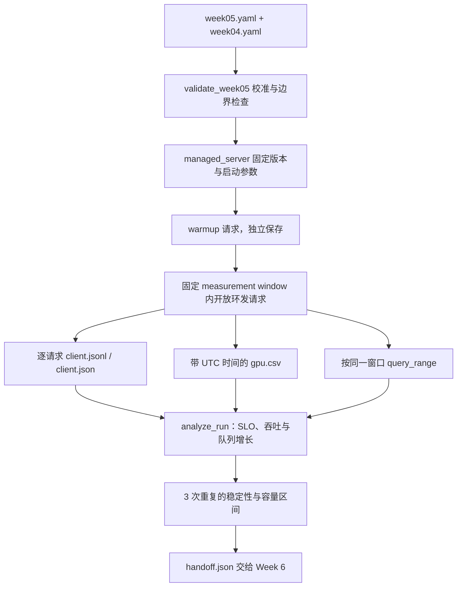

# Week 5 代码导读：观测、SLO 与单实例容量

本周把 Week 4 的一次压测变成可以重建结论的实验：固定 server 配置，只改变到达速率，
同时保存客户端请求、Prometheus 查询、GPU 采样和日志。代码已提供；真实 L4 容量、
SLO 是否合理、Prometheus target 是否可用，需要在实验环境运行后确认。

配套阅读：[学习计划](week-05-plan.md)、[参考资料](week-05-references.md)、
[指标契约](../observability/vllm-metrics.md)、[报告模板](../reports/week05.md)。

## 1. 先看完整的数据流



客户端没有自己实现 vLLM scheduler。它控制请求何时到达，vLLM 决定何时执行；因此
`max_inflight` 是压测端保护上限，`max_num_seqs` 才是 engine 的调度约束之一。

## 2. 推荐代码阅读顺序

| 顺序 | 文件 / 函数 | 阅读时要回答的问题 |
|---|---|---|
| 1 | [week05.yaml](../configs/week05.yaml) | 哪些参数固定，哪些变量会被 sweep？ |
| 2 | [study_contract.py](../src/study_contract.py) `validate_week05` | 什么情况下只能预演、不能跑正式实验？ |
| 3 | [run_week05.py](../scripts/run_week05.py) `main` | mixture、load、repeat 三层循环怎样展开？ |
| 4 | [study_runner.py](../src/study_runner.py) `prepare_jobs`、`request_record`、`run_case` | 请求、时钟、warmup 和失败记录如何流动？ |
| 5 | [capture_run_metrics.py](../src/capture_run_metrics.py) `inventory`、`capture` | 查询是否匹配实际 metric，窗口是否完整？ |
| 6 | [analyze_week05.py](../src/analyze_week05.py) `analyze_run`、`capacity_brackets` | 单次 run 如何变成稳定点和容量区间？ |

## 3. 配置为什么默认不能直接跑正式负载

`calibration.confirmed` 初始为 `false`，`baseline_rps` 和 `evidence` 为 `null`。
这些字段必须依据 Week 4 的实际低负载数据填写，而不是把示例 SLO 当作硬件能力。

`validate_week05(execution=False)` 检查配置结构，所以 Mac 可以预演。`execution=True`
还要求确认校准、提供正数 baseline rps，以及一个存在的 Week 4 证据文件。
这是实验配置校验；代码不会自动认定某个文件已经证明容量。

workload 定义三种请求 shape：short chat、long context、generation。`mixtures` 决定
哪些 shape 在一轮中出现；mixed 的比例为 60% / 20% / 20%。mixed 中每个请求仍按自身
workload 的 SLO 判断，不能把 long context 的宽松阈值套给 short chat。

## 4. 开放环请求怎样产生

`prepare_jobs()` 用指数分布间隔生成 Poisson arrival，并在开始计时前构造精确长度的
token IDs。到达时间与 shape 选择使用两个独立的随机数生成器。同一个 repeat 下改变
rate 时，请求类型序列和 prompt 构造保持一致，到达间隔按 rate 缩放。

```python
offset += arrivals.expovariate(rate)
kind = shapes.choices(workload_names, weights=weights)[0]
```

固定测量时间意味着不同 rate 的请求总数不同，但混合分布、seed 和生成方法相同。
请求直接携带 token IDs，避免“decode 成文本再 tokenize”造成长度变化。prefix caching
显式关闭，因此重复构造 prompt 不应被解释为 APC 收益。

`run_case()` 按每个 job 的计划时间发请求。若压测端已占满 `max_inflight`，它会保存
`client_overflow`，不会等待空位后假装仍按原速率发送。分析器将这种 run 标为 invalid，
因为这时测到的是客户端上限。

## 5. 三种时钟与四个阶段

UTC epoch 用于跨文件对齐；`time.monotonic()` 用于计算间隔和 deadline，避免系统校时
改变 latency。保存的 `*_utc` 是便于人工阅读的 ISO 时间。

1. **Warmup**：顺序发出配置数量的请求，并要求成功，结果写 `warmup.json`。
2. **Measurement**：固定起止时间，只在此期间创建正式 arrival cohort。
3. **Drain**：窗口结束后继续等这些请求终止，受每请求总 timeout 约束。
4. **Cooldown**：等待下一轮开始，单独计时。

每条正式记录都有计划到达、实际开始和终止时间，以及 prompt hash、token 数、status。
首个与最后一个 content 的时间也会保存；离线分析从这些时间戳重算 TTFT、TPOT、E2E，
并检查保存的 latency 是否一致，避免只信任预计算汇总字段。
`client.jsonl` 每完成一个请求就 flush；进程中断后已完成记录仍在。`client.json` 只在
整轮完成后原子写出。失败 session 会保留，而不会被下一轮覆盖。

## 6. TTFT、TPOT 与 Goodput 的具体口径

`request_record()` 复用已有 [openai_stream.py](../src/openai_stream.py) 的 SSE 解析器。
首个非空 content chunk 标记 first content；最后一个非空 content chunk 标记 last content。

```text
TTFT = first_content - scheduled_arrival
TPOT = (last_content - first_content) / (output_tokens - 1)
E2E  = stream_terminal - scheduled_arrival
```

这使客户端发出请求的滞后被计入体验，同时单独保留 `arrival_lag_ms`。超过配置阈值时
实验无效。TPOT 不包含随后到来的 usage / DONE 等待；它是客户端观察的平均输出间隔，
并非逐 token ITL，SSE chunk 也不保证恰好包含一个 token。

成功还要求 DONE、非空内容、`finish_reason=length` 以及精确的 input/output token 数。
性能 workload 使用 `ignore_eos=true` 保证请求 shape；Week 6 的质量样例采用自然终止。

`slo_attained()` 要求请求成功且所有配置的 latency 同时不超过阈值，缺失、负数或 NaN
都不算通过。主 `goodput_rps` 按学习计划计算：

```text
goodput_rps = 本窗口到达且最终满足全部 SLO 的请求数 / measurement_seconds
```

另存 `completed_goodput_rps`，只统计在窗口内完成的合格请求。`achieved_rps` 也只计算
窗口内完成量；drain 才完成的请求记录在 `late_completions`。这样既能解释 cohort 的
体验，也不会把排队到窗口外的完成量当成稳定吞吐。

P50/P95/P99 从成功请求的完整 cohort 计算，同时单独报告错误、timeout 和 SLO attainment。
错误不会被填成 0ms，失败率也不会从容量判定中消失。少量请求的 P99 接近最大值，报告
必须同时写样本数，不能仅凭这个百分位宣称有很精确的尾延迟估计。

## 7. 核心代码精读

### SLO 判定是请求级交集，goodput 才能代表有效容量

`analyze_run()` 先用原始时间戳重建延迟，再调用 `slo_attained()`：

源码：[src/analyze_week05.py](../src/analyze_week05.py)，第 16–22 行；以下为原文摘录，仅移除公共缩进。

```python
def slo_attained(record, slo):
    return record.get("status") == "success" and all(
        isinstance(record.get(key), (int, float))
        and math.isfinite(record[key])
        and 0 <= record[key] <= threshold
        for key, threshold in slo.items()
    )
```

第一道门是 `status == success`，HTTP 错误或未完成 stream 不会因耗时很短而通过。
随后对该 workload 的每项阈值取 `all`：TTFT、TPOT、端到端延迟必须在**同一请求**
上同时满足。类型、finite 和非负检查让缺失值、NaN 与错误时间戳无法被误当作好请求。

例如 100 个请求里 90 个完成，80 个满足 TTFT，75 个满足 TPOT，而两者及其他约束的
交集只有 70 个。若固定统计窗口为 10s，goodput 是 7 requests/s；不是 9，也不是
`min(80, 75)/10`。SLO attainment 的分母仍是全部到达请求，不是成功子集。

`rebuild_latencies()` 以 `scheduled_at` 为起点，first/last content 为流式边界。
这保留了客户端发出延迟；若只从实际发送时刻计时，负载生成器饱和会被隐藏。
接着在 `analyze_run()` 中查看 `seconds`、`attained` 与 `good_in_window`，区分按到达
cohort 计数和必须在窗口内完成的口径；跨窗口的长请求不能悄悄更换分母。

**设计取舍与边界。** 这段函数只能判断单请求达标；容量选点还要求重复完整、队列不
持续增长、客户端未先饱和。低负载下两种配置都能完成全部请求，goodput 相等并不说明
最大容量相等。均值/P95 分别达标也无法证明每个请求都满足联合 SLO。

**读后自检。** 两组请求的 TTFT P95 与 TPOT P95 相同，联合达标数能否不同？构造
“不同请求分别违反两个阈值”的例子，再检查报告是否保留全部失败的分母。

## 8. Prometheus 怎样绑定到 run

`inventory()` 从本次 `/metrics` 读取实际名字和 labels。查询文件只是固定版本的候选
映射；必需 metric 缺失就使 capture 无效，不能从类似名称猜出一个替代指标。

查询限定 `job` 和 `instance`。Histogram 使用 bucket rate 和 `histogram_quantile`；
其查询起点向后偏移四个 scrape interval，让整个 rate lookback 留在 measurement
window 内。counter 保留原始累计值，在离线分析中计算窗口内差分速率。

`capture()` 检查缺序列、NaN、counter reset、query gap 和 stale scrape。
`timestamp(waiting_metric)` 用于识别 Prometheus lookback 反复返回旧 gauge 的情况。
客户端 token throughput 是“窗口内完成请求”的 token 总量；server counter 是“窗口内
发生的 token 工作”，有未完成请求时两者并不完全相等，需要结合 queue 和 drain 解释。

## 9. 怎样判定容量，而不是挑一个最大吞吐数字

一个 run 需同时通过客户端有效性、GPU/Prometheus 证据完整性，以及以下稳定性检查：

- 每个 workload 的 P99 满足其 SLO。
- error / timeout 不超过配置阈值。
- 完成吞吐与实际 arrival cohort 的比值达到要求。
- measurement 后半段的 waiting queue 线性增长率不超过阈值。

`capacity_brackets()` 将相同 mixture/rate 的结果归组，要求准确的三个 repeat 编号。
三次都稳定才是 stable，三次都不稳定才是 unstable；相互矛盾标 inconsistent，缺证据
标 invalid。遇到异常点后不会跳过去挑更高的“稳定容量”。

`handoff.json` 保存实际测到的 low / boundary / overload 速率，只有完整矩阵和一致结论
才标 `ready=true`。它同时携带冻结的 Week 5 配置和 baseline server 身份，Week 6 读取后
不能为了量化方案重新放宽 SLO。

## 10. 运行和产物位置

Mac 预演无需 CUDA、vLLM、Transformers，只需已有的 Python 3.12 与 PyYAML：

```bash
make plan-week05 PYTHON=python3.12
```

在 L4 VM 完成 Week 4 校准、配置已有 Prometheus target 后：

```bash
make run-week05 VLLM_PYTHON=.venv-vllm/bin/python
```

数据位于 `results/week05/raw/sessions/<session-id>/`。session 内保存 server 启动日志、
CLI help、runtime/source 身份、dependency freeze；`runs/<run-id>/` 保存每轮的 metadata、
client、Prometheus、GPU 和该轮 server log。重新运行会创建新 session；本周不跨服务重启
自动拼接未完成的实验。归档失败 session 后再对完整实验目录分析，避免重复 repeat 混入。

同步结果、停止 VM 后在 Mac 运行：

```bash
make analyze-week05 PYTHON=python3.12
```

生成 `analysis.json`、`handoff.json` 和 `figures/` 中的五类图。报告根据这些文件填写。
`managed_server` 停止的是它拥有的 vLLM 进程组；停止 GCP VM 仍使用已有的
`scripts/gcp_vm.sh stop`，并核对磁盘等计费资源。

## 11. 自测与边界

[观测测试](../tests/test_study_observability.py) 覆盖混合 SLO、队列增长、三次重复、
counter reset、stale scrape、seed 重放和 TPOT 截止位置。

阅读后应能解释：为什么有高 goodput 的 run 仍可能不稳定；为什么失败请求必须保留；
为什么 GPU utilization 高不能单独定位 scheduler 或 kernel 瓶颈。真实容量结论只有在
L4、Prometheus 和客户端证据全部具备时才成立。
