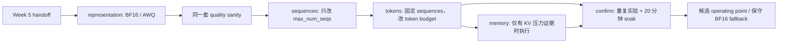

# Week 6 代码导读：量化、小矩阵调优与 Operating Point

本周沿用 Week 5 的 workload、SLO、硬件和负载点，比较模型表示和 engine 参数。代码
提供分阶段运行、输出检查、性能分析及回退配置导出；尚未执行真实量化性能实验。

配套阅读：[学习计划](week-06-plan.md)、[参考资料](week-06-references.md)、
[Week 5 导读](week-05-code-walkthrough.md)、[报告模板](../reports/week06.md)。

## 1. 为什么拆成几次运行



每阶段结束后先分析，再把实际选出的 variant 和参数填回配置。程序不会自动把所有参数
做笛卡尔积，也不会用尚未测量的数据替你填写 selected 值。

## 2. 代码地图

| 文件 / 函数 | 负责的事 |
|---|---|
| [week06.yaml](../configs/week06.yaml) | variant、固定 tokenizer、阶段候选、soak、余量与价格 |
| [benchmark_week06.py](../scripts/benchmark_week06.py) `phase_candidates` | 按当前阶段构造单变量候选 |
| 同文件 `load_handoff` | 校验 Week 5 配置 fingerprint 和 baseline argv |
| [study_contract.py](../src/study_contract.py) `variant_config`、`serve_command` | 显式生成模型、dtype、量化、KV dtype 与 tokenizer 参数 |
| [validate_outputs.py](../src/validate_outputs.py) | 协议、token contract 与小型任务检查 |
| [study_runner.py](../src/study_runner.py) | 与 Week 5 相同的请求、采样和证据格式 |
| [analyze_week06.py](../src/analyze_week06.py) | 调参对比、模型显存解析、confirmation gate、成本 |
| [start_vllm_variant.py](../scripts/start_vllm_variant.py) | 单个 variant 的前台调试入口 |

## 3. BF16 与 AWQ 到底改了什么

两个 checkpoint 都属于 Qwen2.5-0.5B-Instruct，revision 固定在配置中。AWQ 采用发布者的
预量化 checkpoint，本仓库不实施量化算法。运行时通过 `AutoConfig` 对照 model type、
hidden size、层数、attention heads、KV heads、vocabulary，避免误把不同参数规模的模型
当成量化前后。

| 项目 | BF16 baseline | AWQ variant |
|---|---|---|
| 权重表示 | 未量化 checkpoint | AWQ 4-bit checkpoint |
| compute dtype | bfloat16 | float16 |
| tokenizer | 同一个未量化模型的固定 revision | 同左 |
| KV cache dtype 参数 | auto | auto |
| shape、seed、SLO | 来自 Week 5 | 同左 |

AWQ 使用 FP16 compute，因此这是“可用部署表示”的对比，不能声称只改变了权重存储
位宽。`auto` 会跟随相应 compute dtype；BF16/FP16 KV 都占 16 bit，但数值格式不同。
启动日志中的量化 backend、fallback/warning 和实际支持情况必须写进报告。

`managed_server()` 检查 vLLM 版本、单张 L4、CUDA 和环境 dependency freeze。启动时使用
所选 Python 同目录下的 vLLM CLI，防止 `.venv-vllm/bin/python` 却误启动 PATH 中的另一个
vLLM。每个候选结束都会释放本次拥有的进程组，然后才启动下一个。

## 4. load_handoff 怎样防止比较条件漂移

`load_handoff()` 要求 Week 5 的 `ready=true`，核对当前 Week 5 配置与保存配置的完整
fingerprint，并验证 baseline server argv。每个启动的候选还会与 Week 5 的 GPU/runtime
身份对照。low / boundary / overload 直接读取测量结果，不根据量化后的表现重新选点。

不同阶段的 selected 参数本来会变化，分析器按每个候选的实际 `overrides` 记录变化；
共同的 workload、handoff、模型集合、tokenizer、代码文件和 runtime 必须保持一致。
失败的 variant 留在 `cells` 中，不作为可比较性能候选。

## 5. 输出验证先于性能测量

[week06-quality.json](../configs/week06-quality.json) 固定了 24 条小型样例：算术、中英文、
JSON、长上下文抽取，以及靠近 context 上限的输入。模板通过固定 tokenizer 的
`apply_chat_template()` 渲染，之后把 token IDs 发给 completions endpoint。

`validate_suite()` 使用 greedy decoding，逐条保存结果。边界样例填充到
`max_model_len - max_output_tokens`，不会为了让量化方案运行成功而缩短 context。

`check_output()` 分成两层：

1. HTTP/schema、非空输出、乱码/非有限标记、异常重复及 usage 一致性。
2. exact、contains 或 JSON 结构化任务检查。

所有结构性检查必须通过，任务通过比例还需达到配置阈值。失败时停止该 variant 的
性能矩阵，保存 `quality.json` 与 `failure.json`，继续记录其他候选。这组检查说明是否
适合继续实验，不代表 AWQ 与 BF16 在模型质量上等价。

生成内容只来自仓库内固定的合成测试题，保存在 quality evidence 中供人工抽查。
`manual_review` 初始为 `pending`；检查输出后再将相应 evidence 标为 `passed`，最终
operating point gate 才能通过。不要直接批量改标记来绕过质量核对。

## 6. phase_candidates 怎样限制实验变量

`representation` 返回 BF16 和 AWQ，各自运行四类 mixture、三个负载点和三次重复。
其他调参阶段主要在 mixed workload 上运行：

```python
# sequences: 原始 token budget / memory utilization 保持不变
[(variant, {"max_num_seqs": 8}), ...]

# tokens: 使用上一阶段选出的 sequences
[(variant, {"max_num_seqs": selected, "max_num_batched_tokens": 2048}), ...]
```

memory 阶段要求给出已保存的 KV pressure evidence 文件。它改变显存预算，但不同时
改变 context 长度或模型。若该阶段执行并选出新的比例，在配置中设置
`tuning.selected_gpu_memory_utilization`，confirmation 才会使用它；省略时延续 baseline。

`confirm` 单独启动两个配置：选出的候选，以及保守 BF16 baseline。两者都运行 mixed
的三个负载点、三次重复，并在 boundary 点执行默认 1200 秒 soak。这个 fallback 有
自己的实测证据，不能只因为“配置看起来保守”就称它已验证。

## 7. 分析器如何选配置

每轮首先复用 Week 5 的 `analyze_run()`。`confirm_cell()` 进一步检查：

- boundary 具备全部 repeat 编号，且每次都满足 SLO 和稳定性。
- soak 完整、时长达标且稳定。
- boundary / soak 中 KV usage 峰值留有至少 10% 余量。
- 质量 sanity 和人工抽查均通过。

候选还需展示可重复收益：在固定 overload 点的最差 repeat goodput 仍优于 fallback
的最好 repeat 达到预设幅度；或者 boundary goodput 接近，同时模型权重显存明显降低。
这里选择 overload 做吞吐收益对比，因为在低负载下两个配置可能都已完成全部 offered
requests，单看 boundary goodput 容易掩盖容量提升。

`model_memory_gib()` 解析 server 启动日志中模型加载的显存。它不把 `nvidia-smi` 的总占用
当作权重大小：vLLM 常常把节省的显存再用于 KV cache。未找到可识别的日志字段时记为
`null`，不能按 0 GiB 计算“显存节省”。

价格默认也是 `null`。填入实际每小时实例价格后，才计算：

```text
USD / 1000 good requests = hourly_usd × 1000 / (3600 × goodput_rps)
```

这是单实例运行成本口径，未包含磁盘、下载、闲置 VM 等额外费用。报告需单独记录
完整实验的计费时长。

## 8. 命令与结果

先在 Mac 检查 representation 计划：

```bash
make plan-week06 PYTHON=python3.12
```

在已准备好的 L4 环境按阶段运行：

```bash
make run-week06 WEEK06_PHASE=representation
# 保存结果并分析后，填写 selected_variant。
make run-week06 WEEK06_PHASE=sequences
# 填写 selected_max_num_seqs。
make run-week06 WEEK06_PHASE=tokens
# 填写 selected_max_num_batched_tokens；有必要时再执行 memory。
make run-week06 WEEK06_PHASE=confirm
```

每次分析在结果同步后运行 `make analyze-week06 PYTHON=python3.12`。最终正式结论还需
停止 VM，并完成报告和资源核对。数据在 `results/week06/raw/sessions/<session-id>/`，
每个候选有独立 `experiment.json`、`model-config.json`、`quality.json`、server 日志和 runs。

单 variant 调试入口默认只打印命令，`--run` 才启动，Ctrl-C 结束并清理：

```bash
PYTHON=.venv-vllm/bin/python bash scripts/start_vllm_variant.sh --variant awq --run
```

## 9. 学完应当能解释什么

为什么权重更小不一定让 TTFT 更低；为什么 `gpu-memory-utilization` 不等于实测
GPU utilization；为什么不能同时扫描所有变量再挑最好结果；为什么没有量化收益时，
经过验证的 BF16 fallback 仍是有效实验结论。

[质量与配置测试](../tests/test_study_quality.py) 验证 token contract、结构正确但任务错误、
阶段依赖、固定 tokenizer 和不可用 handoff。真实 AWQ kernel、L4 显存收益及 soak 稳定性
仍必须在 GPU 环境验证。
