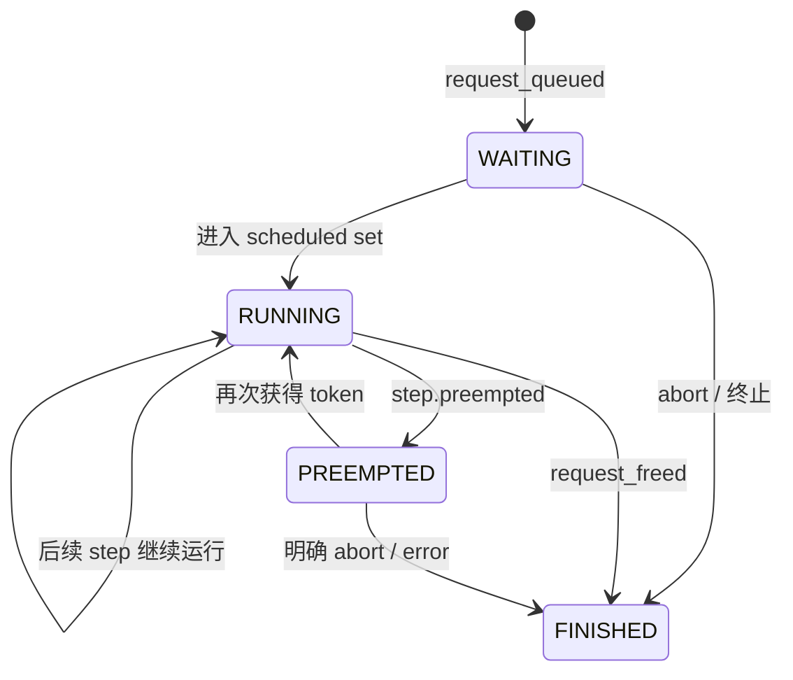

# Week 8 代码导读：Scheduler Decision、Token Budget 与 KV 压力

本周观察真实 V1 scheduler 已经做出的决定，解析每一步的请求集合、token 分配和状态
变化。代码提供四个短场景、默认关闭的 trace patch、invariant parser、CSV 表和图。
它不实现新的 scheduling policy，也不把合成测试当作 vLLM 性能证据。

配套阅读：[学习计划](week-08-plan.md)、[参考资料](week-08-references.md)、
[scheduler map](vllm-scheduler-map.md)、[Week 7 导读](week-07-code-walkthrough.md)、
[报告模板](../reports/week08.md)。

## 1. 从一个问题开始读源码

每次 `Scheduler.schedule()` 要在当前约束下回答：

```text
现在有哪些 waiting / running requests？
这一步还能安排多少 token？最多允许多少 active sequences？
KV blocks 能否分配？不能时哪些请求等待或被 preempt？
```

固定版本的 V1 代码没有为普通调度维护互相独立的 prefill/decode 两套阶段循环。它围绕
`num_computed_tokens` 与请求当前 token 数的差额分配工作：长 prompt 的差额较大，普通
decode 往往只需要补一个 token。不要把教学图里的“prefill 阶段”直接当成内部状态 enum。

## 2. 代码地图

| 文件 / 函数 | 作用 |
|---|---|
| [week08.yaml](../configs/week08.yaml) | 四个确定性场景、到达间隔、prompt/output shape 和单变量 override |
| [week08-scheduler-trace.patch](../patches/week08-scheduler-trace.patch) | 在 schedule 决定产生后采集摘要，在 allocation failure 处记录原因 |
| [build_trace_patches.py](../scripts/build_trace_patches.py) | 基于 Week 7 patch 重建 Week 8 patch |
| [run_source_study.py](../scripts/run_source_study.py) `scenario_requests`、`run_week08` | 按场景启动服务、发请求、等待 terminal trace |
| [parse_scheduler_trace.py](../src/parse_scheduler_trace.py) `parse_events` | 校验预算与状态，重建 transitions / steps |
| 同文件 `write_tables`、`draw` | 保存机器可读结果及五类图 |

先看 scenario 配置并手算前几步，再阅读 patch 的字段采样点，最后检查 parser 怎样验证
你的手算。源码规则见独立 scheduler map，避免把 trace schema 当作算法定义。

## 3. Patch 放在什么位置

入口保存 `running_before`、`waiting_before` 和单调递增的 step 编号。算法自身完成后，
在 `_update_after_schedule()` 增加 computed token 计数之前记录 `step` event。

```python
scheduled = [
    dict(request_id=rid, tokens=count,
         computed_tokens=request.num_computed_tokens,
         prompt_tokens=request.num_prompt_tokens)
    for rid, count in num_scheduled_tokens.items()
]
```

这段采样读取原有 decision，不重新计算谁应该被调度。`computed_tokens` 是该步更新前
的计数，用于判断 prompt 是否尚未完成。`preempted` 来自 scheduler 已有列表。

两个 `allocate_slots()` 返回 `None` 的位置分别记录 `kv_allocation_failed`：running
路径可能进一步触发 preemption，waiting 路径也可能只是不 admit。只有 waiting 上升
不足以证明 KV 压力，必须同时看 allocation 结果或明确的 preemption。

## 4. 四个场景具体改变什么

| 场景 | 请求 | 改动 | 要寻找的证据 |
|---|---|---|---|
| baseline | 32 input / 8 output | 无 | 从 queued、首次调度到 free 的最小生命周期 |
| mixed | 一个 2048 input，再到两个 short requests | 无 | 长 prompt 和 short requests 的 admission 顺序 |
| token_pressure | short decode 与 2048-token prefill | token budget=256，显式启用 chunked prefill | 长 prompt 分成多个 step，decode 与 prefill 共用预算 |
| kv_pressure | 三个 1536 input / 512 output | 仅 `num_gpu_blocks_override=256` | allocation failure、可能的 preemption/requeue、最终释放 |

KV 场景使用固定版本支持的 block override，保持 token budget 原值，避免同时压低
两个限制。配置中的 `256 × 16 = 4096` 是常见 16-token block 的解释例子，实际 block
size 和可用容量仍以启动日志为准，parser 不把这个估算当作实测值。

`kv_pressure` 可能只观察到 waiting admission failure，也可能出现 running preemption。
如果运行没有触发目标机制，分析保存 `not_observed_reason`，不会虚构 KV pressure。
下一次只改变一个相关维度并保留独立 session。

## 5. Parser 如何重建状态

`load_events()` 合并同一场景的 PID 文件，按单机 monotonic timestamp 排序。schema
错误、不完整 JSON 行和 `trace_truncated` 都会使解析失败。

`parse_events()` 只消费 scheduler component，且要求只有一个 scheduler PID。它维护
一个 `request_id → state` 字典，状态机为：



`PREEMPTED` 在实际 scheduler 中已经被放回 waiting queue；因此统计 waiting 时，parser
把 WAITING 和 PREEMPTED 一起计数，但保留状态区别来解释 requeue。

完成事件来自实际 `_free_blocks()` 之后，附 `FINISHED_*` 原因。preempted request 不能
未经 resumed 就凭空正常完成；它要么再次运行，要么有明确 abort/error。默认要求最终
所有请求 terminal，`--allow-partial` 只允许诊断中断 trace，不会补造结束事件。

## 6. 每一步检查哪些 invariant

1. step 必须从 0 连续递增，避免合并了两次 server run 或漏掉事件。
2. 同一步不能重复安排同一 request，也不能既 scheduled 又 preempted。
3. scheduled tokens 均为正整数，总和不得超过 initial budget。
4. `remaining = initial - sum(scheduled tokens)`。
5. scheduled request 数和 running 数均不超过 `max_num_seqs`。
6. 根据状态机计算的 before/after queue 数必须与实际 snapshot 一致。
7. 已释放请求不能再次出现在 scheduled set。

这些检查能发现坏 trace 和错误解释；它们不是 scheduler 正确性的完整形式化证明。
speculative decoding、encoder inputs、LoRA、prefix-hit admission、异步调度等额外分支
不在最小实验支持范围，新增这些条件前要相应扩充 schema 和验证规则。

## 7. 怎样识别 chunked prefill

某个 scheduled entry 满足以下条件时，该步只完成了 prompt 的一部分：

```text
computed_tokens < prompt_tokens
computed_tokens + scheduled_tokens < prompt_tokens
```

parser 将其 ID 放入 `chunked_requests`。例如 2048-token prompt 在首步 computed=0、
scheduled=256，说明该步之后还剩 prompt 工作。下一步是否继续、是否被抢占，需要看
实际 trace，不能只用 `ceil(2048/256)` 断言 scheduler 一定连续安排八步。

可选的 chunked prefill on/off 对比需要单独复制相同 workload 的配置；关闭时不能保留
小于最大 context 的 token budget 而强求启动成功。当前默认四场景不把这个可选对比
当成已执行，也不自动为启动成功悄悄修改其他参数。

## 8. 图表分别回答什么

- `request-state-timeline.png`：状态转换发生在哪个 step；它画事件，不表示该请求占满
  了两个事件之间所有 GPU 时间。
- `step-scheduled-tokens.png`：实际 token 分配和预算。
- `step-running-waiting.png`：内部队列数量。
- `token-vs-kv-pressure.png`：预算剩余、preemption 数、KV usage 分轴展示，避免混用单位。
- `internal-queue-vs-client-ttft.png`：同机 monotonic 时间上的 queue 与客户端 TTFT。

同时保存 `steps.csv`、`transitions.csv` 和 `analysis.json`。图里的结论必须能回到这些
原始字段；client/server `/metrics` 快照也保留以便与 Week 5 指标对应。这是短时机制
实验，不使用带 trace 的吞吐数与 Week 5/6 无 trace baseline 直接比较。

## 9. 命令和结果目录

Mac 预演：

```bash
make plan-week08 PYTHON=python3.12
```

在 Week 7 已 patch 且可 import 的固定 checkout 上应用第二份 patch：

```bash
git -C vendor/vllm apply --check ../../patches/week08-scheduler-trace.patch
git -C vendor/vllm apply ../../patches/week08-scheduler-trace.patch
make run-week08 VLLM_PYTHON=.venv-vllm/bin/python
```

单独重跑一个场景：

```bash
PYTHON=.venv-vllm/bin/python bash scripts/run_week08_scenarios.sh --run --scenario kv_pressure
```

结果在 `results/week08/traces/<scenario>/<session-id>/`。每个场景单独启动和停止 server，
保持 step=0 和状态机初始为空，不把不同配置的 events 合并。

在 Mac 重新解析同步后的证据：

```bash
python3.12 -m src.parse_scheduler_trace \
  --trace-dir results/week08/traces/baseline/SESSION_ID \
  --client results/week08/traces/baseline/SESSION_ID/client.json \
  --output results/week08/analysis/baseline
```

## 10. 自测与 Week 9 交接

[scheduler 测试](../tests/test_scheduler_study.py) 覆盖 budget overflow、sequence overflow、
重复 step、坏 queue snapshot、finished 后重新调度、preempt 后未恢复和不完整日志。

学完应能解释一次 request 为什么等待：是 sequence 数满、token budget 不够，还是
allocate slots 失败。Week 9 再深入 block manager 的分配、释放、prefix reuse 与 eviction
算法；本周只观察这些接口的输入、返回值和后果。
