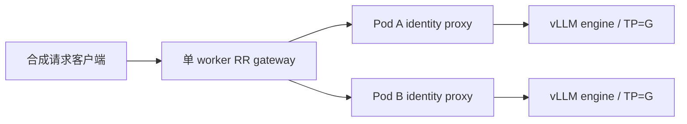

# Week 15 中文代码导读：多副本 RR 与 Streaming 生命周期

本周从一个完整 vLLM replica 扩展到两个独立 replica，用请求级证据检查分发、冷启动、
排空与失败。对应 [学习计划](week-15-plan.md)、[参考资料](week-15-references.md)、
[运行约定](week-13-16-runbook.md)、[报告模板](../reports/week15.md)。

## 1. 数据路径与文件



| 文件 | 作用 |
|---|---|
| [rr_gateway.py](../src/rr_gateway.py) | endpoint discovery、请求级 RR、SSE 转发与断连传播 |
| [cluster_contract.py](../src/cluster_contract.py) | Deployment/Service/RBAC/HPA 的统一构造 |
| [run_cluster_study.py](../scripts/run_cluster_study.py) | 明确 context 的集群操作、warmup、重复、快照与 timeline |
| [week15-multireplica.yaml](../configs/week15-multireplica.yaml) | 单/双副本、HPA burst 与四种 workload |
| [rr.yaml](../deploy/gateway/rr.yaml) | 单 worker gateway 与 EndpointSlice 只读 RBAC 模板 |
| [multireplica.yaml](../deploy/vllm/multireplica.yaml) | 每副本 vLLM + identity sidecar 模板 |
| [hpa.yaml](../deploy/autoscaling/hpa.yaml) | CPU-based HPA：min=1 / max=2 |
| [analyze_routing.py](../src/analyze_routing.py) | 请求归属、RR 次序、attempt 与 GPU allocation 积分 |

identity proxy 使用同一个轻量代理模块，但固定一个 localhost engine endpoint。它把
真实 Pod UID 写入响应 header 和日志，供 RR 与 Week 16 使用同一条后端归属链路。
它本身也有开销；正式报告需要看代理 CPU、客户端 arrival lag 与 engine 指标。

## 2. 为什么 RR 选择发生在 handler 内

`RoundRobin.select()` 在一个 asyncio event loop 中选择 endpoint、递增 index/sequence，
中间没有 `await`。因此一次 HTTP 请求对应一次选择。上游 TCP keep-alive 只复用连接，
不决定下一次请求的目标；同一客户端连接上的连续请求也会再次调用 select。

每次 endpoint 集合变化会递增 `epoch` 并重置 index。日志记录 gateway ID、epoch、
sequence、Ready UID 集合、选中 Pod 和 request ID。`rr_verdict()` 先按 gateway/epoch
分组，再按 admission sequence 排序，检查轮转次序、序号完整性和每个前缀的计数差。
完成时间可能乱序，所以不能用日志出现的先后顺序验证 RR。

网关只运行一个 worker；增加 worker 时各有自己的 sequence，分析也必须按 worker
分别验证。不要把普通 Kubernetes Service 的连接分发称为这段请求级 RR。

## 3. 核心代码精读

### 一次 endpoint 选择究竟在哪个边界生效

`proxy()` 在建立 upstream POST 前调用 `RoundRobin.select()`；先精读这个很短的临界区：

源码：[src/rr_gateway.py](../src/rr_gateway.py)，第 38–46 行；以下为原文摘录，仅移除公共缩进。

```python
def select(self):
    if not self.endpoints:
        raise web.HTTPServiceUnavailable(text="no Ready replica endpoints")
    # No await between selection and increment: atomic in this one event loop.
    endpoint = self.endpoints[self.index % len(self.endpoints)]
    self.index = (self.index + 1) % len(self.endpoints)
    self.sequence += 1
    return endpoint, self.epoch, self.sequence
```

空候选立即 503；取模选择后推进 index，再递增全局 sequence，连同 endpoint 和 epoch
返回。在一个 event loop 中，这段代码没有 `await`，别的 coroutine 不会在选择和递增
之间切入。这个保证只适用于单 worker 进程，不等于跨进程原子操作。

假设 endpoints 为 A/B，从 index=0 开始，两次请求依次选 A、B，即使 B 先完成，
sequence 仍反映 admission 顺序。`update()` 把 endpoint 按 UID 排序，集合改变时重置
index 并增加 epoch；Pod 被同名替换后 UID 改变，必须按新 epoch 验证轮转。

### 背压来自 await write，取消来自连接生命周期

源码：[src/rr_gateway.py](../src/rr_gateway.py)，第 151–163 行；以下为原文摘录，仅移除公共缩进。

```python
            tail = combined[-32:]
            # write() applies downstream backpressure, without aggregating SSE chunks.
            await response.write(chunk)
        if payload.get("stream") and upstream.status < 400 and not done:
            raise ConnectionError("upstream stream ended without DONE")
        await response.write_eof()
        record["status"] = "completed" if upstream.status < 400 else "upstream_error"
        return response
except asyncio.CancelledError:
    # AppRunner(handler_cancellation=True) delivers client disconnect here even while
    # upstream has produced no new bytes. Exiting the context closes upstream.
    record["status"] = "client_cancelled"
    raise
```

每次 write 等待下游接受数据；客户端慢时，gateway 不会先把无限输出积在一个 Python
列表里。循环结束后检查流式完成标记，再写 EOF。客户端取消会重新抛出
`CancelledError`，而退出外层 upstream context 关闭上游连接，将断连传播给 vLLM。

**设计取舍与边界。** 这里没有应用级 retry；headers 已发出后无法把状态改成 502，
只能中断流并保存失败。搜索 `[DONE]` 是代理的轻量完成检查，严格 SSE/usage 验证仍在
客户端。端点选择针对完整 `1 Pod / 1 node / G GPUs / TP=G` replica，无法选择内部 rank。

**读后自检。** 把 `select()` 中间加入 `await` 会破坏哪条假设？让两个 worker 共享
同一组 endpoints 但各自保留 index，为什么不能再要求汇总日志严格 A/B 交替？

## 4. EndpointSlice 与 readiness

`discovery()` 每秒从 Kubernetes API 读取实验 Service 的 EndpointSlice，只保留
`ready=true`、非 terminating、具有 Pod UID 的 endpoint，然后检查 `/health`。
读取凭证只用于请求 Kubernetes API，不进入日志；RBAC 只允许 get/list EndpointSlice。

发现失败时清空候选列表，入口返回 503，防止长期用过期 endpoint。已有 SSE 已选定
upstream，不因发现集合变化而迁移。更新延迟和已入场请求可能造成短时不均衡，报告按
epoch 对齐后解释，不能要求 churn 期间仍遵守固定两端点的严格轮转。

HTTP `/health` 仅表示当前可接入。正式测量前，runner 对每个新 Pod 直接做模型 warmup
与 generation smoke；first token 的实际时间仍需从客户端与 timeline 对齐。

## 5. SSE、backpressure 与取消

`proxy()` 创建一个 upstream POST，关闭 redirect，也没有应用级 retry。读取到的 bytes
通过 `StreamResponse.write()` 立即下发；下游慢时 await write 形成 backpressure，
不会把整条 SSE 聚合成一个响应。

`handler_cancellation=True` 让客户端断开时取消 handler，即使 upstream 暂时没输出也能
进入 `CancelledError`。退出 upstream response context 会关闭连接，让 vLLM 感知断开。
真正释放 engine 请求/KV 还需要在真实 vLLM queue/abort 指标中验证。

已经发送 headers 后出现异常，HTTP status 不能重新改成 502。代码关闭下游连接，日志
记为 `interrupted`；客户端因缺 `[DONE]`/usage 失败。请求不会切到另一个副本重试，避免
把重复生成伪装成连续 stream。HTTP 和 SSE 失败语义分别保留在原始结果中。

## 6. Deployment 为什么是这个形状

每个 Pod 包含 vLLM engine 和 identity proxy，共享同一个 Pod network namespace。
vLLM 只监听 localhost:8000，Service 进入 sidecar:8081。GPU allocation 全部在 engine
container，一次申请 G 张 GPU；TP=G、PP=1，Pod 内所有 ranks 留在同一个 node。

模型启动使用长 startup probe；Ready 后才进入 endpoint pool。滚动更新配置
`maxSurge=0/maxUnavailable=1`，避免在两副本预算之外临时再申请一个完整 G-GPU Pod。
代价是更新期间容量降低，单副本更新存在空窗。`preStop` 与 grace 仅提供排空机会，
并不证明真实长请求已经排空，必须做 lifecycle 实验。

模型 cache 默认 emptyDir，Pod 重建会丢失。这里的重启是 model-cache cold 的一类路径；
若改为 PVC 复用 cache，必须另记录 cached/uncached，不能合并冷启动数据。

## 7. 运行 RR 和 HPA

```bash
make plan-week15 PYTHON=python3.12
bash scripts/run_week15_baseline.sh --render --output /tmp/week15-template.yaml
# 填好 baseline/cluster-lab 两个版本锁后，在独立实验集群运行：
bash scripts/run_week15_baseline.sh --preflight
bash scripts/run_week15_baseline.sh --server-dry-run --case rr
bash scripts/run_week15_baseline.sh --apply --case rr
kubectl --context LAB_CONTEXT -n serving-lab port-forward service/rr-gateway 8080:80
# 在另一终端；端口转发属于客户端入口，不是服务性能最优路径。
bash scripts/run_week15_baseline.sh --run --case rr --rate low --cache-state cold --cancel-smoke
```

正式容量测量时宜把同一个 load generator 放到集群内，避免 `kubectl port-forward`
成为瓶颈；修改 endpoint 并记录连接路径。低负载语义 smoke 可以使用 port-forward。

`--cache-state cold/warm` 每个 workload/repeat 前重启实验 Deployment，并直接逐 Pod
warmup；warm 还预填充 shared families。`mixed` 保持已有进程用于持续流量观察，但不保证
独立 cache 初始化。HPA burst 要预先核对初始 current/Ready=1，确保上一轮未留下两个副本。

HPA 使用 CPU utilization 与明确 CPU requests，min=1/max=2；它只控制 `vllm` Deployment
的 replica count。比较固定 single、rr 和 hpa_burst 时同时报告实际 GPU allocation，
不能把动态 HPA 和始终双副本称为同预算 A/B。CPU 不触发时记录当前 workload 的事实。

## 8. Lifecycle 与失败

先启动长流量，再在另一终端运行：

```bash
bash scripts/run_week15_baseline.sh --rollout --deployment vllm --observe-seconds 180
# 仅对当前独立实验 namespace 中明确标记为 serving-study 的 Pod：
bash scripts/run_week15_baseline.sh --fail-pod --pod EXPERIMENT_POD --observe-seconds 180
```

runner 核对资源标签后才操作，保存 action 时间和 before/after snapshot。
`timeline.jsonl` 每轮保存 Pods/Deployments/HPA，包括 desired/current/Ready 和 Pod 条件。
把它与客户端 first-content 时间、endpoint snapshot、vLLM 日志关联，可以区分
调度、image pull、model load、Ready、route admission 与首 token。

强制 Pod 删除是失败注入，会中断 stream；它需要用户在实验环境主动调用。
生成本代码并没有执行任何集群变更、删除 Pod 或创建计费资源。

## 9. 验证与交接

本地测试已经覆盖真实 HTTP/SSE 的 RR、首段及时转发、取消和异常断流。
这证明代理实现的这些行为，不证明 GPU 容量、实际 vLLM abort 或 Kubernetes drain。
报告还需逐副本 queue/cache/request/token、代理资源、HPA 和账单证据。

Week 16 保留模型、engine、G、TP 和 identity 数据路径，固定双副本关闭 HPA，只引入
Gateway API 的 L7 matching 和 weighted backend contract。
