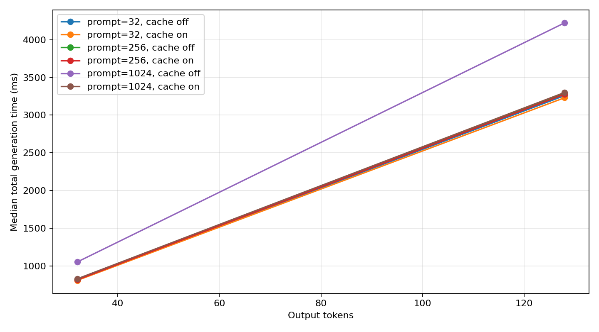
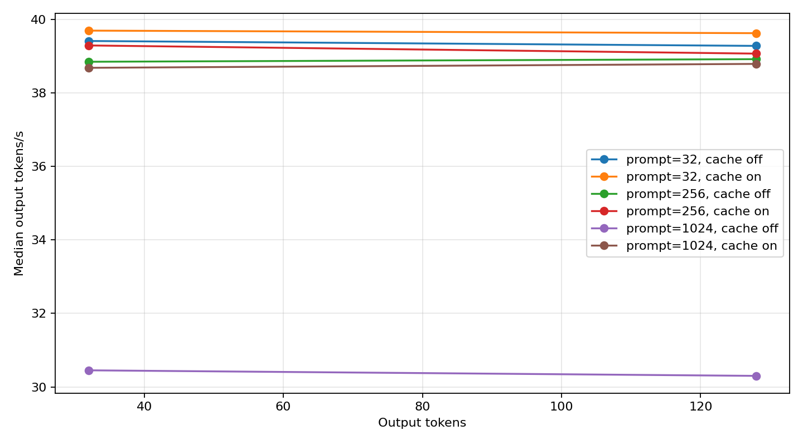

# Week 1: Prefill, Decode, and KV Cache

## Question

How do prompt length, output length, and KV caching affect single-request LLM inference latency and throughput?

## Environment

Run ID: `3ee8d8e8-f677-44d9-937a-6acc8c0fde9f`. The formal matrix used source
commit `3c2df0b6efe887b6d74f2384757922f0d05c2c32` on a GCP
`g2-standard-4` Spot VM in `us-central1-a`:

- GPU: 1 x NVIDIA L4, 23034 MiB, compute capability 8.9
- Driver: 580.178.04; CUDA runtime: 12.8
- OS/kernel: Ubuntu 24.04, Linux `7.0.0-1014-gcp`
- Python: 3.12.3
- PyTorch: 2.8.0+cu128
- Transformers: 4.46.3; Accelerate: 1.1.1
- Dtype: BF16

The complete machine-readable environment is in
[`results/week01/environment.json`](../results/week01/environment.json).

## Method

- Model: `Qwen/Qwen2.5-0.5B-Instruct`
- Revision: `7ae557604adf67be50417f59c2c2f167def9a775`
- Runtime: Python 3.12, PyTorch 2.8.0 + CUDA 12.8, Transformers 4.46.3
- Decoding: greedy
- Warmup: 2 runs
- Repetitions: 5 per configuration
- Prompt tokens: 32, 256, 1024
- Output tokens: 32, 128
- Independent variable: KV cache on/off
- Correctness gate: the first `min(32, output_tokens)` generated tokens must match;
  full-sequence hashes remain recorded separately
- `inference_ttft_ms`: H2D + prefill forward + first-token selection
- `total_generation_ms`: inference TTFT + all post-first-token decode steps
- `end_to_end_ms`: tokenization + total generation

Each formal value below is the median of five repetitions. Cache-on was always
run immediately before cache-off for the same shape and repeat. All 60 formal
rows passed schema, runtime-identity, timing-decomposition, and 32-token parity
validation.

## Results

| Prompt | Output | Cache on total | Cache off total | Off/on | Cache on tok/s | Cache off tok/s | Cache on peak | Cache off peak |
|---:|---:|---:|---:|---:|---:|---:|---:|---:|
| 32 | 32 | 806.25 ms | 812.02 ms | 1.01x | 39.69 tokens/s | 39.41 tokens/s | 970.41 MB | 985.94 MB |
| 32 | 128 | 3230.67 ms | 3259.11 ms | 1.01x | 39.62 tokens/s | 39.27 tokens/s | 972.61 MB | 1013.93 MB |
| 256 | 32 | 814.53 ms | 823.84 ms | 1.01x | 39.29 tokens/s | 38.84 tokens/s | 1043.23 MB | 1116.99 MB |
| 256 | 128 | 3276.67 ms | 3289.35 ms | 1.00x | 39.06 tokens/s | 38.91 tokens/s | 1045.80 MB | 1144.15 MB |
| 1024 | 32 | 827.34 ms | 1050.81 ms | 1.27x | 38.68 tokens/s | 30.45 tokens/s | 1295.44 MB | 1562.89 MB |
| 1024 | 128 | 3300.26 ms | 4224.18 ms | 1.28x | 38.78 tokens/s | 30.30 tokens/s | 1298.02 MB | 1591.05 MB |





## Observations

1. KV caching mattered only once the history was long enough. At prompt length
   1024, disabling the cache increased median total generation time by 27.0% for
   32 output tokens and 28.0% for 128 output tokens. Throughput fell from
   38.78 to 30.30 tokens/s in the 1024/128 workload. At prompt lengths 32 and
   256, the measured total-time difference was only 0.4-1.1%.
2. Output length scaled nearly linearly. With cache on and a 1024-token prompt,
   increasing output length from 32 to 128 increased total time from 827.34 ms
   to 3300.26 ms, almost exactly the expected 4x for four times as many output
   tokens.
3. Cache mode did not remove prefill. Across both output lengths, median prefill
   forward time at prompt length 1024 was 34.16 ms with cache on and 28.73 ms
   with cache off. Writing the initial KV state has a cost, but that roughly
   5.4 ms difference was far smaller than the 923.92 ms cache-off decode penalty
   in the 1024/128 workload.
4. Measured peak allocation was lower with cache on in every shape. For 1024/128
   it was 1298.02 MB versus 1591.05 MB without cache. This does not mean a KV
   cache is free: cache-off repeatedly materialized longer-sequence temporary
   tensors, and `max_memory_allocated` includes those workspaces as well as the
   persistent KV state.
5. All formal pairs matched for the required first 32 tokens. The five
   prompt-32/output-128 pairs had different full-output hashes. A diagnostic
   reproduction found the first BF16 greedy divergence at zero-based token index
   35, after 35 matching tokens. Fixed tensor shapes and token counts make the
   timing comparison usable, but the numerical divergence remains a limitation.

## Limitations

- This is single-request eager Hugging Face inference, not production serving.
- The model is intentionally small and does not represent large-model memory pressure.
- Results from one GPU type should not be compared directly with another GPU type.
- The experiment does not cover continuous batching, request scheduling, or network latency.
- Cache-on was always measured before cache-off, so an order effect is possible.
- BF16 cache-on and cache-off paths use different matrix shapes and were required
  to match only within a 32-token parity window. Later greedy output can diverge.
- The figures connect only two output-length points per prompt length; they show
  the measured endpoints rather than establishing a general scaling law.

## What I Learned

Prefill processes the complete prompt in parallel and produces the logits for the
first output token. Its user-facing latency contribution is the main part of TTFT
(time to first token), together with host-to-device transfer and first-token
selection. Decode is sequential: every new token depends on all tokens before it.
TPOT measures the time between output tokens after the first one, so it describes
streaming cadence rather than initial responsiveness.

The KV cache stores the attention Key and Value tensors produced for previous
positions. During cached decode, the model processes only the newest token and
attends to the stored history. Without the cache, each step recomputes the whole
growing sequence. The tradeoff is persistent memory for less repeated compute.

For this Qwen model (`24` layers, `2` KV heads, head dimension `64`, BF16), the
approximate single-sequence KV size at sequence length 1024 is:

```text
2 x 24 x 2 x 64 x 1024 x 2 bytes = 12 MiB
```

The measured peak-memory difference is much larger than 12 MiB because it also
contains model weights, activations, allocator state, and temporary attention
workspaces. This is why a peak-allocation measurement cannot be interpreted as a
direct KV-cache-size measurement.

## Next Week

- Add systematic sequence-length sweeps and more than two output-length points.
- Measure batch-size effects while keeping the Week 1 timing definitions.
- Break down model weights, activations, temporary workspaces, and theoretical
  KV-cache memory rather than relying only on peak allocation.

